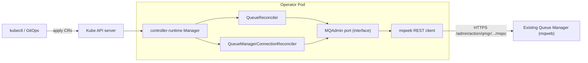

# AGENTS.md

This document is the entry point for humans and AI agents working on the
**Kurator**. It captures what the project is, how it is
structured, and the conventions every change must follow. Read it before
making changes, and keep it in sync when conventions evolve.

## Documentation map

Start here, then drill into the topic you need:

| Document | What it covers |
|----------|----------------|
| **AGENTS.md** (this file) | Project context, conventions, toolchain, workflow. |
| [docs/INSTALL_AND_USE.md](docs/INSTALL_AND_USE.md) | **User guide:** install, connect, queues, samples, troubleshooting. |
| [config/samples/README.md](config/samples/README.md) | Annotated sample Secret / Connection / Queue YAML. |
| [docs/ARCHITECTURE.md](docs/ARCHITECTURE.md) | Components, runtime concerns, CRDs, reconcile flow, security. |
| [docs/NON_FUNCTIONAL_REQUIREMENTS.md](docs/NON_FUNCTIONAL_REQUIREMENTS.md) | NFRs: security, reliability, observability, performance, supply chain. |
| [docs/DEVELOPMENT.md](docs/DEVELOPMENT.md) | Prerequisites, tools, inner loop, local cluster, test tiers. |
| [docs/LOGGING.md](docs/LOGGING.md) | Structured logging configuration, requirements, and guidelines. |
| [docs/CICD.md](docs/CICD.md) | CI/CD pipeline design and the `verify` discipline. |
| [docs/ROADMAP.md](docs/ROADMAP.md) | Phased delivery plan. |
| [docs/adr/](docs/adr/) | Architecture Decision Records (one file per significant decision). |
| [docs/IBM_MQ_OBJECTS.md](docs/IBM_MQ_OBJECTS.md) | MQSC object model the operator manages. |
| [docs/IBM_MQ_REST_API.md](docs/IBM_MQ_REST_API.md) | How the `mqweb` REST API is consumed. |
| [docs/IBM_MQ_101.md](docs/IBM_MQ_101.md) | Local MQ console, `runmqsc` CLI, verify Kurator on kind. |
| [docs/REFERENCES.md.example](docs/REFERENCES.md.example) | IBM MQ samples map (copy to gitignored `docs/REFERENCES.md` locally). |
| [charts/kurator/README.md](charts/kurator/README.md) | Publishable Helm chart and kind install. |
| [docs/PHASE4_CHANNEL_AUTH.md](docs/PHASE4_CHANNEL_AUTH.md) | Phase 4 channel/auth CR sketch from reference MQSC. |
| [SECURITY.md](SECURITY.md) | Security posture and vulnerability reporting. |

## Overview

Kurator is a Kubernetes operator that manages
**resources on an existing IBM MQ Queue Manager** declaratively, the
self-service way: queues, and (later) users/authorities and related objects.

What it **does**:

- Reconciles custom resources (e.g. `Queue`) into MQSC objects on a running
  Queue Manager.
- Connects to the Queue Manager through the **IBM MQ Administrative REST API**
  (`mqweb`) over HTTPS, using credentials from a referenced `Secret`.
- Detects drift, reports status via conditions, and cleans up via finalizers.

What it **does not do** (explicit non-goals, for now):

- It does **not** deploy, scale, or manage Queue Manager installations
  themselves. The Queue Manager is assumed to already exist and expose `mqweb`.
- It does not manage messages/payloads, only administrative objects.

This is a personal project with a strong emphasis on a **clean, well-tested,
tight** codebase. Prefer small, focused, fully-tested changes over breadth.

## Architecture summary



- Reconcilers are **thin**: they translate desired/observed state and delegate
  all MQ interaction to the `MQAdmin` **port** (a Go interface).
- The `mqweb` REST client is the only adapter implementation today. The port
  seam keeps a future PCF backend possible without touching controllers
  ([ADR-0002](docs/adr/0002-manage-mq-via-mqweb-rest.md)).
- Mocks of the `MQAdmin` port (generated by mockery) drive fast unit tests.
- Credentials and connection details come from a referenced Kubernetes
  `Secret`, never hard-coded.

For the full design see [docs/ARCHITECTURE.md](docs/ARCHITECTURE.md).

## Repository layout

The project is built with **Kubebuilder v4 / controller-runtime**, mirroring the
layout of mature operators. The `hack/` and `docs/` trees already exist; the Go
trees land during scaffolding (see [ROADMAP.md](docs/ROADMAP.md), Phase 1).

```
.
├── api/v1alpha1/              # CRD Go types (Queue, QueueManagerConnection) + deepcopy   [Phase 1+]
├── cmd/                       # main.go: manager wiring/entrypoint                         [Phase 1+]
├── internal/
│   ├── controller/           # reconcilers (thin) + their tests                           [Phase 2+]
│   ├── mqadmin/              # MQAdmin port (interface) + domain types                     [Phase 2+]
│   └── adapter/mqrest/       # mqweb REST client implementing MQAdmin                       [Phase 2+]
├── charts/kurator/            # publishable Helm chart + kind sample CRs                    [Phase 3+]
├── config/                    # Kustomize: CRDs, RBAC, manager, samples                    [Phase 1+]
├── test/
│   ├── e2e/                  # kind-based end-to-end suites                                 [Phase 3+]
│   └── mocks/                # mockery-generated mocks                                      [Phase 2+]
├── hack/
│   └── kind-cluster/         # local platform: kind + Terraform + IBM MQ Helm chart        [present]
│       ├── kind/             # kind cluster config (NodePorts 30080/30443)
│       ├── scripts/          # kind-up/down, mkcert-gen, terraform-apply, info, cleanup
│       ├── terraform/        # ingress-nginx, cert-manager, monitoring, IBM MQ
│       └── charts/ibm-mq/    # vendored IBM MQ Helm chart
├── docs/                      # ARCHITECTURE, NFRs, DEVELOPMENT, CICD, ROADMAP, adr/, MQ refs [present]
├── Taskfile.yml               # primary task runner                                         [Phase 1+]
├── Taskfile.test.yml          # test-related tasks                                          [Phase 1+]
├── .golangci.yaml             # linter config (v2)                                          [Phase 1+]
├── .mockery.yaml              # mock generation config                                      [Phase 2+]
├── .pre-commit-config.yaml    # pre-commit hooks                                            [Phase 1+]
├── SECURITY.md                # security posture + reporting                                [present]
└── AGENTS.md / README.md
```

> Module `github.com/konradheimel/kurator`, API group `messaging.kurator.dev`,
> version `v1alpha1` — see [ADR-0006](docs/adr/0006-project-name-kurator.md).

## Toolchain & dependencies

Pin everything; reproducible builds are non-negotiable. Tool binaries are
pinned via Go's `tool` directive in `go.mod` (`go tool <name>`), so CI and local
runs use identical versions with no extra install step.

| Concern | Choice | How it's pinned |
|---------|--------|-----------------|
| Language | **Go** (latest stable; `go.mod` `go` line is the floor) | `go.mod` |
| Scaffolding | **Kubebuilder v4** (`go.kubebuilder.io/v4` in `PROJECT`) | `PROJECT` |
| Runtime | **controller-runtime** + `client-go`/`apimachinery` | `go.mod` |
| Codegen | **controller-gen** (CRDs, RBAC, deepcopy) | `go tool` |
| Manifests | **kustomize** | `go tool` |
| Mocks | **mockery v3** (`.mockery.yaml`) | `go tool` |
| Test framework | **Ginkgo v2** + **Gomega** | `go tool` (ginkgo) + `go.mod` |
| envtest | **setup-envtest** (pinned K8s API version) | `go tool` |
| Lint | **golangci-lint v2** (`.golangci.yaml`) | `go tool` |
| Vuln scan | **govulncheck** | CI (pinned action/version) |
| Task runner | **Task** (`Taskfile.yml` + `Taskfile.test.yml`) | documented prereq |
| Local cluster | **kind** + **Terraform** + **Helm** | `hack/kind-cluster` |

Dependency hygiene:

- Keep `go.mod` tidy (`go mod tidy`); commit `go.sum`.
- A bot (**Renovate** or **Dependabot**) proposes dependency and action bumps;
  see [docs/CICD.md](docs/CICD.md).
- Run `govulncheck ./...` in CI and act on findings.
- Pin GitHub Actions to commit SHAs, not floating tags.

## Go conventions

### Error handling

- Wrap errors with context: `fmt.Errorf("reconcile queue: %w", err)`.
- Always add meaningful context when returning errors up the stack.
- Use `errors.Is` / `errors.As` for inspection and unwrapping.
- Define sentinel/typed errors at the port (`mqadmin`) boundary so controllers
  can branch on them (e.g. `ErrNotFound`, transient vs. terminal) without
  parsing strings. See [ARCHITECTURE.md](docs/ARCHITECTURE.md#error-handling--requeue-strategy).

```go
func (r *QueueReconciler) ensure(ctx context.Context, q *v1alpha1.Queue) error {
    if err := r.mq.DefineQueue(ctx, q.Spec); err != nil {
        return fmt.Errorf("define queue %q: %w", q.Spec.Name, err)
    }
    return nil
}
```

### Formatting & linting

- Format with `gofmt`, `goimports`, and `golines` (max line length 120).
- Lint with **golangci-lint v2** (`default: none`, explicit opt-in). Enabled
  linters: `copyloopvar`, `dupl`, `errcheck`, `ginkgolinter`, `goconst`,
  `gocyclo`, `govet`, `ineffassign`, `lll` (120), `misspell`, `nakedret`,
  `prealloc`, `revive`, `staticcheck`, `unconvert`, `unparam`.
- Generated code (`zz_generated.*`, mocks) is excluded/lax.
- CI **fails** on any lint or formatting error.

### Build & security

- Build static, CGO-free binaries: `CGO_ENABLED=0`. The REST-based design has
  no native MQ client dependency, so the build stays pure Go.
- Run tests with the race detector: `go test ./... -race`.
- Run `govulncheck ./...` regularly and in CI.
- Never log secrets, credentials, or full request bodies that may contain them.

### Style

- Follow the [Uber Go Style Guide](https://github.com/uber-go/guide/blob/master/style.md)
  / [Google Go Style Guide](https://google.github.io/styleguide/go/).
- Keep reconcilers thin; push logic into testable, mockable seams.
- Prefer table-driven and behaviour-focused tests.
- Reconcilers must be **idempotent** and safe to re-run; never assume a single
  pass. Drive everything from observed vs. desired state.

## Testing strategy

Testing is a first-class concern. **A change is not done until it is tested.**
See [docs/DEVELOPMENT.md](docs/DEVELOPMENT.md) for how to run each tier.

- **Framework**: [Ginkgo](https://onsi.github.io/ginkgo/) + Gomega.
- **Unit tests**: exercise reconcilers and the REST adapter against
  **mockery**-generated mocks of the `MQAdmin` port and an `httptest` server.
  Fast, no cluster required.
- **envtest**: controller/API integration against a real API server via
  `setup-envtest`, with the `MQAdmin` port mocked. Co-located with controllers
  (`*_envtest_test.go`), `suite_test.go` loads CRDs from `config/`.
- **e2e**: run the operator in **kind** against a real IBM MQ container exposing
  `mqweb` (provisioned by `hack/kind-cluster`); assert actual MQSC objects are
  created/updated/deleted. Gated behind a build tag (`//go:build e2e`).
- Track coverage (`-cover -coverprofile`) and keep it high on `internal/`; CI
  reports coverage and treats a regression as a failure to investigate.

## Tooling & workflow

[Task](https://taskfile.dev) is the single entry point for all workflows
(`Taskfile.yml` for build/deploy, `Taskfile.test.yml` for tests). Target set
(mirroring the reference operator):

| Task | Purpose |
|------|---------|
| `task install` | Download/verify Go module dependencies |
| `task format` | Auto-fix formatting/lint issues |
| `task lint` | Run golangci-lint |
| `task manifests` | Generate CRDs + RBAC via controller-gen |
| `task generate` | Generate deepcopy + mocks |
| `task verify` | Fail if generated artifacts (manifests/deepcopy/mocks) are stale |
| `task build` | Build the manager binary (CGO-free, static) |
| `task docker:build` | Build the controller-manager image |
| `task local:up` / `task local:down` | Full local stack: kind + IBM MQ + operator + samples / teardown |
| `task local:deploy` / `task local:info` | Refresh operator on existing cluster / URLs + CR status |
| `task cluster:up` / `task cluster:down` | Platform only (`hack/kind-cluster`) |
| `task cluster:info` | Print MQ/Grafana/Argo CD URLs and credentials |
| `task mq:console` / `task mq:cli` / `task mq:runmqsc` | IBM MQ web UI URL; interactive or one-shot `runmqsc` on kind QM1 |
| `task deploy` / `task deploy:helm` | Install operator (Kustomize or Helm; uses `go tool kustomize`) |
| `task deploy:samples` | Apply sample Secret + CRs (`charts/kurator/samples/resources/`) |
| `task undeploy` / `task undeploy:helm` | Remove operator |
| `task helm:package` | Package `charts/kurator` for publish |
| `task test:run` | Run unit + envtest suites (Ginkgo) |
| `task test:e2e` | Run kind-based e2e suite |
| `task ci:e2e` | Full e2e parity with CI (`cluster:up` + MQ wait + `test:e2e`) |

**Local dev** uses kind for both the dev cluster and e2e, provisioned by
`hack/kind-cluster` (kind + Terraform + IBM MQ Helm chart). See
[docs/DEVELOPMENT.md](docs/DEVELOPMENT.md).

**pre-commit** hooks keep commits clean: at minimum `gofmt`/`goimports`,
`golangci-lint`, and `task verify` (generated artifacts up to date). Mocks are
generated by **mockery** from `.mockery.yaml`.

### The generate / verify discipline

All generated artifacts (CRDs, RBAC, deepcopy, mocks) are committed and must
never drift from source. `task generate && task manifests` regenerates them;
`task verify` regenerates into a scratch area and fails on any diff. This runs
in pre-commit and CI, so a stale commit can never be merged.

## CI/CD

CI runs on **GitHub Actions**; the full design is in
[docs/CICD.md](docs/CICD.md). At a glance:

- **PR checks**: `verify` (codegen/manifests fresh) → `lint` → `test:run`
  (unit + envtest, `-race`, coverage) → `build` → `govulncheck`.
- **e2e**: kind-based job spinning up IBM MQ and asserting real MQSC.
- **Security**: `govulncheck` (periodic + PR), Trivy image scan, pinned action
  SHAs, dependency bot.
- **Release**: build/push the controller image and publish install manifests on
  tags.
- CI **fails** on lint, format, codegen drift, test failure, or vuln findings.

## Commit conventions

- **Atomic commits**: one logical change per commit; keep the tree green at
  every commit (build, lint, and tests pass).
- Use [Conventional Commits](https://www.conventionalcommits.org/). No JIRA
  prefix (personal project).
- **A [gitmoji](https://gitmoji.dev/) is required** and goes immediately after
  the first colon, before the summary.
- Subject under ~50 chars; body explains the *what* and *why* when useful.

Required subject format:

```
<type>(<optional scope>): :gitmoji: <short summary>

[optional body]
```

Types: `feat`, `fix`, `docs`, `style`, `refactor`, `test`, `chore`, `ci`,
`build`.

Common gitmoji (see [gitmoji.dev](https://gitmoji.dev/) for the full list):

| Gitmoji | Code | Use for |
|---------|------|---------|
| ✨ | `:sparkles:` | New feature |
| 🐛 | `:bug:` | Bug fix |
| 📝 | `:memo:` | Documentation |
| ✅ | `:white_check_mark:` | Add/update/pass tests |
| ♻️ | `:recycle:` | Refactor |
| 🔧 | `:wrench:` | Configuration files |
| 👷 | `:construction_worker:` | CI build system |
| 🧱 | `:bricks:` | Infrastructure changes |
| 🙈 | `:see_no_evil:` | `.gitignore` changes |
| ⬆️ / ⬇️ | `:arrow_up:` / `:arrow_down:` | Up/downgrade dependencies |

Examples:

```
feat(queue): :sparkles: reconcile Queue into MQSC DEFINE QLOCAL
fix(mqrest): :bug: retry on 5xx from mqweb admin endpoint
docs: :memo: document QueueManagerConnection secret reference
test(controller): :white_check_mark: add envtest for deletion finalizer
```

## Decision records

Significant or non-obvious decisions are captured as short ADRs in
[docs/adr/](docs/adr/) (module path, REST vs PCF, connection model, tooling).
When you make a decision that future-you would question, add an ADR rather than
burying the rationale in a commit message.

## References

- [controller-runtime](https://pkg.go.dev/sigs.k8s.io/controller-runtime)
- [Kubebuilder book](https://book.kubebuilder.io/)
- [IBM MQ administrative REST API](https://www.ibm.com/docs/en/ibm-mq/latest?topic=api-administration-using-rest)
- [golangci-lint](https://golangci-lint.run)
- [mockery](https://vektra.github.io/mockery/)
- [Ginkgo](https://onsi.github.io/ginkgo/) / [Gomega](https://onsi.github.io/gomega/)
- [kind](https://kind.sigs.k8s.io/)
- [Task](https://taskfile.dev)
- [Working with Errors in Go 1.13](https://go.dev/blog/go1.13-errors)
- [govulncheck](https://pkg.go.dev/golang.org/x/vuln/cmd/govulncheck)
- [Kubernetes API conventions](https://github.com/kubernetes/community/blob/master/contributors/devel/sig-architecture/api-conventions.md)
- [Operator best practices](https://sdk.operatorframework.io/docs/best-practices/)
