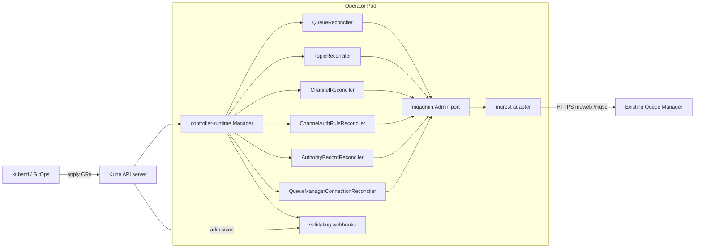

# AGENTS.md

This document is the entry point for humans and AI agents working on the
**Kurator**. It captures what the project is, how it is
structured, and the conventions every change must follow. Read it before
making changes, and keep it in sync when conventions evolve.

## Documentation map

**AGENTS.md** (this file) — project context, conventions, toolchain, workflow.

Full doc index by role (with navigation emojis): **[docs/README.md](docs/README.md)**.

| | Document | What it covers |
|---|----------|----------------|
| 🎯 | [docs/INSTALL_AND_USE.md](docs/INSTALL_AND_USE.md) | User guide: install, connect, CRs, troubleshooting. |
| 🎯 | [docs/UPGRADE.md](docs/UPGRADE.md) | Upgrade operator, CRDs, webhooks, cert-manager. |
| 🎯 | [docs/OBSERVABILITY.md](docs/OBSERVABILITY.md) | Metrics, ServiceMonitor, Prometheus scrape. |
| 🏗️ | [docs/LOGGING.md](docs/LOGGING.md) | Structured logging configuration. |
| ✉️ | [docs/CONTRIBUTING.md](docs/CONTRIBUTING.md) | Developer guidelines, Conventional Commits, gitmoji. |
| 🔧 | [config/samples/README.md](config/samples/README.md) | Annotated sample Secret, Connection, Queue, Topic, Channel YAML. |
| 🏗️ | [docs/ARCHITECTURE.md](docs/ARCHITECTURE.md) | Components, runtime, CRDs, reconcile flow, security. |
| 🏗️ | [docs/ATTRIBUTE_RECONCILIATION.md](docs/ATTRIBUTE_RECONCILIATION.md) | DEFINE vs DISPLAY drift matrix per MQ object type. |
| 🛠️ | [docs/LOCAL_SETUP.md](docs/LOCAL_SETUP.md) | Install dev tools (Go, Task, kind, Terraform, …). |
| 🛠️ | [docs/DEVELOPMENT.md](docs/DEVELOPMENT.md) | Prerequisites, inner loop, local cluster, test tiers. |
| 🛠️ | [docs/DEVELOPER_GUIDE.md](docs/DEVELOPER_GUIDE.md) | CRD codegen checklist, test tiers per change, MQAdmin mocks. |
| 🧩 | [docs/GO_MODULE.md](docs/GO_MODULE.md) | Go module layout, import layers, arch lint. |
| ⚙️ | [docs/OPERATOR_RUNTIME.md](docs/OPERATOR_RUNTIME.md) | Manager wiring, probes, concurrency, shutdown. |
| 📋 | [docs/ROADMAP.md](docs/ROADMAP.md) | Phased delivery plan. |
| 📋 | [docs/CICD.md](docs/CICD.md) | CI/CD pipeline and `verify` discipline. |
| 📋 | [docs/NON_FUNCTIONAL_REQUIREMENTS.md](docs/NON_FUNCTIONAL_REQUIREMENTS.md) | NFRs: security, reliability, observability, performance. |
| 📚 | [docs/IBM_MQ_OBJECTS.md](docs/IBM_MQ_OBJECTS.md) | MQSC research inventory (not the product API). |
| 📚 | [docs/IBM_MQ_REST_API.md](docs/IBM_MQ_REST_API.md) | How the `mqweb` REST API is consumed. |

## Overview

Kurator is a Kubernetes operator that manages
**resources on an existing IBM MQ Queue Manager** declaratively: queues (local,
alias, remote), topics, SVRCONN channels, **channel auth (CHLAUTH)**, and **OAM
authority records (AUTHREC)**.

What it **does**:

- Reconciles custom resources (`Queue`, `Topic`, `Channel`, `ChannelAuthRule`,
  `AuthorityRecord`) into MQSC objects on a running Queue Manager.
- Connects to the Queue Manager through the **IBM MQ Administrative REST API**
  (`mqweb`) over HTTPS, using credentials from a referenced `Secret`.
- Detects drift, reports status via conditions, emits Kubernetes **Events** on
  status transitions, and cleans up via finalizers.

What it **does not do** (explicit non-goals, for now):

- It does **not** deploy, scale, or manage Queue Manager installations
  themselves. The Queue Manager is assumed to already exist and expose `mqweb`.
- It does not manage messages/payloads, only administrative objects.

This is a personal project with a strong emphasis on a **clean, well-tested,
tight** codebase. Prefer small, focused, fully-tested changes over breadth.

## Architecture summary



- Reconcilers are **thin**: they translate desired/observed state and delegate
  all MQ interaction to the `mqadmin.Admin` **port** (Go interface; docs often
  call it MQAdmin). Reconcilers use typed port methods only — never raw `RunMQSC`
  ([ADR-0014](docs/adr/0014-mq-error-taxonomy-and-requeue.md)); `RunMQSC` on the
  REST client is for e2e/integration fixtures.
- The `mqweb` REST client is the only adapter implementation today. The port
  seam keeps a future PCF backend possible without touching controllers
  ([ADR-0002](docs/adr/0002-manage-mq-via-mqweb-rest.md)).
- Mocks of the `MQAdmin` port (generated by mockery) drive fast unit tests.
- Credentials and connection details come from a referenced Kubernetes
  `Secret`, never hard-coded.
- Validating admission webhooks (`internal/webhook`, `internal/validation`) reject
  invalid CR specs before reconcile; no mqweb calls.

For the full design see [docs/ARCHITECTURE.md](docs/ARCHITECTURE.md).

## Repository layout

The project is built with **Kubebuilder v4 / controller-runtime**, mirroring the
layout of mature operators (see [ROADMAP.md](docs/ROADMAP.md) for delivery phases).

```
.
├── api/v1alpha1/              # CRD Go types (QMC, Queue, Topic, Channel, ChannelAuthRule, AuthorityRecord) + deepcopy
├── cmd/                       # main.go: manager wiring/entrypoint
├── internal/
│   ├── controller/           # reconcilers (thin) + their tests
│   ├── validation/           # admission validation rules (pure functions)
│   ├── webhook/              # validating webhook handlers
│   ├── mqadmin/              # MQAdmin port (interface) + domain types
│   └── adapter/mqrest/       # mqweb REST client implementing MQAdmin
├── charts/kurator/            # publishable Helm chart + kind sample CRs
├── config/                    # Kustomize: CRDs, RBAC, manager, webhook, samples
├── test/
│   ├── integration/          # Docker MQ integration tests (build tag integration)
│   ├── e2e/                  # kind-based end-to-end suites
│   └── mocks/                # mockery-generated mocks
├── hack/
│   ├── kind-cluster/         # local platform: kind + Terraform + IBM MQ Helm chart
│   ├── install-external-tool.sh  # pinned kind/mkcert/task/terraform → bin/
│   └── tools-check.sh        # tiered dev tool verification
├── .devcontainer/             # Cursor/VS Code dev container (optional)
├── docs/                      # ARCHITECTURE, LOCAL_SETUP, DEVELOPMENT, adr/, MQ refs
├── Brewfile                   # macOS: brew bundle for dev dependencies
├── Taskfile.yml               # primary task runner
├── Taskfile.test.yml          # test-related tasks
├── cliff.toml / CHANGELOG.md  # git-cliff release notes
├── .golangci.yaml             # linter config (v2)
├── .mockery.yaml              # mock generation config
├── .pre-commit-config.yaml    # pre-commit hooks
├── SECURITY.md                # security posture + reporting
└── AGENTS.md / README.md
```

> Module `github.com/konih/kurator`, API group `messaging.kurator.dev`,
> version `v1alpha1`. GitHub org/repo: [konih/kurator](https://github.com/konih/kurator).
> See [ADR-0006](docs/adr/0006-project-name-kurator.md).

## Toolchain & dependencies

Pin everything; reproducible builds are non-negotiable. Tool binaries are
pinned via Go's `tool` directive in `go.mod` (`go tool <name>`), so CI and local
runs use identical versions with no extra install step.

| Concern | Choice | How it's pinned |
|---------|--------|-----------------|
| Language | **Go** (latest stable; `go.mod` `go` line is the floor) | `go.mod` |
| Scaffolding | **Kubebuilder v4** (`go.kubebuilder.io/v4` in `PROJECT`) | `PROJECT` |
| Runtime | **controller-runtime** + `client-go`/`apimachinery` | `go.mod` |
| Codegen | **controller-gen** (CRDs, RBAC, deepcopy) | `go tool` |
| Manifests | **kustomize** | `go tool` |
| Mocks | **mockery v3** (`.mockery.yaml`) | `go tool` |
| Test framework | **Ginkgo v2** + **Gomega** | `go tool` (ginkgo) + `go.mod` |
| envtest | **setup-envtest** (pinned K8s API version) | `go tool` |
| Lint | **golangci-lint v2** (`.golangci.yaml`) | `go tool` |
| Vuln scan | **govulncheck** | CI (pinned action/version) |
| Task runner | **Task** (`Taskfile.yml` + `Taskfile.test.yml`) | documented prereq; `task tools:install` for CI-pinned binaries |
| Local cluster | **kind** + **Terraform** + **Helm** | `hack/kind-cluster`; see [LOCAL_SETUP.md](docs/LOCAL_SETUP.md) |

Dependency hygiene:

- Keep `go.mod` tidy (`go mod tidy`); commit `go.sum`.
- A bot (**Renovate** or **Dependabot**) proposes dependency and action bumps;
  see [docs/CICD.md](docs/CICD.md).
- Run `govulncheck ./...` in CI and act on findings.
- Pin GitHub Actions to commit SHAs, not floating tags.

## Go conventions

### Error handling

- Wrap errors with context: `fmt.Errorf("reconcile queue: %w", err)`.
- Always add meaningful context when returning errors up the stack.
- Use `errors.Is` / `errors.As` for inspection and unwrapping.
- Define sentinel/typed errors at the port (`mqadmin`) boundary so controllers
  can branch on them (e.g. `ErrNotFound`, transient vs. terminal) without
  parsing strings. See [ARCHITECTURE.md](docs/ARCHITECTURE.md#error-handling--requeue-strategy).

```go
func (r *QueueReconciler) ensure(ctx context.Context, q *v1alpha1.Queue) error {
    if err := r.mq.DefineQueue(ctx, q.Spec); err != nil {
        return fmt.Errorf("define queue %q: %w", q.Spec.Name, err)
    }
    return nil
}
```

### Formatting & linting

- Format with `gofmt`, `goimports`, and `golines` (max line length 120).
- Lint with **golangci-lint v2** (`default: none`, explicit opt-in). Enabled
  linters: `copyloopvar`, `dupl`, `errcheck`, `ginkgolinter`, `goconst`,
  `gocyclo`, `gosec`, `govet`, `ineffassign`, `lll` (120), `misspell`, `nakedret`,
  `prealloc`, `revive`, `staticcheck`, `unconvert`, `unparam`.
- Generated code (`zz_generated.*`, mocks) is excluded/lax.
- CI **fails** on any lint or formatting error.

### Build & security

- Build static, CGO-free binaries: `CGO_ENABLED=0`. The REST-based design has
  no native MQ client dependency, so the build stays pure Go.
- Run tests with the race detector: `go test ./... -race`.
- Run `govulncheck ./...` regularly and in CI.
- Never log secrets, credentials, or full request bodies that may contain them.

### Style

- Follow the [Uber Go Style Guide](https://github.com/uber-go/guide/blob/master/style.md)
  / [Google Go Style Guide](https://google.github.io/styleguide/go/).
- Keep reconcilers thin; push logic into testable, mockable seams.
- Prefer table-driven and behaviour-focused tests.
- Reconcilers must be **idempotent** and safe to re-run; never assume a single
  pass. Drive everything from observed vs. desired state.

## Testing strategy

Testing is a first-class concern. **A change is not done until it is tested.**
See [docs/DEVELOPMENT.md](docs/DEVELOPMENT.md) for how to run each tier.

**Machine lock:** `task test:e2e`, `task test:e2e:helm`, `task ci:e2e`, and
`task test:integration` share `hack/kind-cluster/.state/locks/exclusive-test.lock`
via `hack/ci/suite-lock.sh` — only one suite at a time per host.

- **Framework**: [Ginkgo](https://onsi.github.io/ginkgo/) + Gomega.
- **Unit tests**: exercise reconcilers and the REST adapter against
  **mockery**-generated mocks of the `MQAdmin` port and an `httptest` server.
  Fast, no cluster required.
- **envtest**: controller/API integration against a real API server via
  `setup-envtest`, with the `MQAdmin` port mocked. Co-located with controllers
  (`*_envtest_test.go`), `suite_test.go` loads CRDs from `config/`.
- **Admission**: envtest installs `ValidatingWebhookConfiguration`
  (`internal/webhook/v1alpha1/suite_test.go`); table-driven tests for
  `internal/validation`; no MQ.
- **Integration**: `mqrest` queue, topic, channel, CHLAUTH, and AUTHREC operations
  against live mqweb in a **Docker** IBM MQ container (`hack/mq-docker`); stdlib
  `testing`, build tag `//go:build integration`, env `KURATOR_INTEGRATION_MQ=1`.
  No kind/operator.
- **e2e**: run the operator in **kind** against a real IBM MQ container exposing
  `mqweb` (provisioned by `hack/kind-cluster`); assert actual MQSC objects are
  created/updated/deleted, including Phase 5 `ChannelAuthRule` and
  `AuthorityRecord`. Gated behind a build tag (`//go:build e2e`). Use
  `task test:e2e:helm` for the Helm deploy path (`KURATOR_E2E_DEPLOY=helm`).
- Track coverage (`-cover -coverprofile`) and keep it high on `internal/`; CI
  reports coverage and treats a regression as a failure to investigate.

## Tooling & workflow

[Task](https://taskfile.dev) is the single entry point for all workflows
(`Taskfile.yml` for build/deploy, `Taskfile.test.yml` for tests). Target set
(mirroring the reference operator):

| Task | Purpose |
|------|---------|
| `task install` | Download/verify Go module dependencies |
| `task tools:check` | Verify dev tools by tier A/B/C (`TOOLS_TIER` env) |
| `task tools:install` | Download CI-pinned kind/mkcert/task/terraform into `bin/` |
| `task format` | Auto-fix formatting/lint issues |
| `task lint` | Run golangci-lint (incl. depguard) and go-arch-lint layer checks |
| `task arch:lint` | Check internal package layers (go-arch-lint) |
| `task arch:graph` | Regenerate `docs/diagrams/internal-deps.svg` |
| `task manifests` | Generate CRDs + RBAC via controller-gen |
| `task generate` | Generate deepcopy + mocks |
| `task verify` | Fail if generated artifacts (manifests/deepcopy/mocks) are stale |
| `task test:schema` | CRD OpenAPI spec fragment contract (also run inside `task verify`) |
| `task test:schema:update` | Regenerate `test/schema/golden/` from `config/crd/bases` |
| `task secrets:scan` | Scan git history for secrets (gitleaks) |
| `task vuln:check` | Run govulncheck against code and dependencies |
| `task build` | Build the manager binary (CGO-free, static) |
| `task docker:build` | Build the controller-manager image |
| `task local:up` / `task local:down` | Full local stack: kind + IBM MQ + operator + samples / teardown |
| `task local:deploy` / `task local:info` | Refresh operator on existing cluster / URLs + CR status |
| `task cluster:up` / `task cluster:down` | Platform only (`hack/kind-cluster`) |
| `task cluster:info` | Print MQ/Grafana/Argo CD URLs and credentials |
| `task mq:console` / `task mq:cli` / `task mq:runmqsc` | IBM MQ web UI URL; interactive or one-shot `runmqsc` on kind QM1 |
| `task deploy` / `task deploy:helm` | Install operator (Kustomize or Helm; uses `go tool kustomize`) |
| `task deploy:samples` | Apply sample Secret + CRs (`charts/kurator/samples/resources/`) |
| `task undeploy` / `task undeploy:helm` | Remove operator |
| `task helm:package` | Package `charts/kurator` for publish |
| `task helm:lint` | `helm lint` + admission/RBAC template verify (`hack/helm-verify-*.sh`) |
| `task test:run` | Run unit + envtest suites (Ginkgo) |
| `task test:integration` | MQ integration tests vs Docker mqweb (`KURATOR_INTEGRATION_MQ=1`) |
| `task test:integration:local` | `mq:integration:up` + wait + `test:integration` |
| `task mq:integration:up` / `down` | Start/stop Docker IBM MQ for integration tests |
| `task test:e2e` | Run kind-based e2e suite (Kustomize deploy) |
| `task test:e2e:helm` | Same suite with Helm deploy (`KURATOR_E2E_DEPLOY=helm`) |
| `task ci:e2e` | Full e2e parity with CI (`cluster:up` + MQ wait + `test:e2e`) |
| `task ci:integration` | CI parity for Docker MQ integration tests |
| `task changelog` | Preview unreleased changelog (git-cliff) |
| `task changelog:write` | Regenerate `CHANGELOG.md` from tags + unreleased commits |
| `task changelog:release` | Print changelog section for the latest tag |

**Makefile (Kubebuilder scaffold):** overlapping targets (`manifests`, `generate`,
`test-schema`, `test-schema-update`, `docker-build`, `install`, `deploy`, `undeploy`)
delegate to the Task equivalents above so both entry points produce the same artifacts.
Maintainer workflows `preflight.yaml`, `nightly.yaml`, and `release-gate.yaml` are in
[docs/CICD.md](docs/CICD.md) (no Makefile targets). Prefer `task` for humans,
pre-commit, and CI ([ADR-0004](docs/adr/0004-task-as-task-runner.md)). E2e deploys
via `task deploy` in `test/e2e/deploy_helpers.go`. See [DEVELOPMENT.md](docs/DEVELOPMENT.md#task-vs-makefile).

**Local dev** uses kind for both the dev cluster and e2e, provisioned by
`hack/kind-cluster` (kind + Terraform + IBM MQ Helm chart). Tool install:
[docs/LOCAL_SETUP.md](docs/LOCAL_SETUP.md). Workflow:
[docs/DEVELOPMENT.md](docs/DEVELOPMENT.md).

**pre-commit** hooks keep commits clean: at minimum `gofmt`/`goimports`,
`golangci-lint`, and `task verify` (generated artifacts up to date). Mocks are
generated by **mockery** from `.mockery.yaml`. Do not use `git commit
--no-verify` routinely — see [Pre-commit and skipping hooks](#pre-commit-and-skipping-hooks-no-verify) below.

### The generate / verify discipline

All generated artifacts (CRDs, RBAC, deepcopy, mocks) are committed and must
never drift from source. `task generate && task manifests` regenerates them;
`task verify` regenerates into a scratch area and fails on any diff. This runs
in pre-commit and CI, so a stale commit can never be merged.

## CI/CD

CI runs on **GitHub Actions**; the full design is in
[docs/CICD.md](docs/CICD.md). At a glance:

- **PR checks** ([`ci.yaml`](.github/workflows/ci.yaml)): `verify` → `lint` →
  `test:run` (unit + envtest, `-race`, coverage + Codecov) → `build` →
  `docker-build` → `helm:lint` (`helm lint` plus
  [`hack/helm-verify-rbac.sh`](hack/helm-verify-rbac.sh) and admission template
  checks — keeps Helm ClusterRole aligned with Phase 5 auth CRDs).
- **Integration** ([`integration.yaml`](.github/workflows/integration.yaml)):
  Docker IBM MQ + mqweb; CHLAUTH and AUTHREC paths included.
- **E2E** ([`e2e.yaml`](.github/workflows/e2e.yaml)): kind + IBM MQ; Kustomize
  deploy in CI; local parity via `task ci:e2e` or `task test:e2e:helm` for Helm.
- **Host lock**: only one of `test:e2e`, `test:e2e:helm`, `ci:e2e`, or
  `test:integration` at a time per machine (`hack/ci/suite-lock.sh`).
- **Security**: `govulncheck` in the `test` job, Trivy on release tags, gitleaks,
  pinned action SHAs, Renovate (weekly workflow).
- **Release**: [docs/RELEASE.md](docs/RELEASE.md) — tag only after CI +
  integration + e2e are green on the **exact commit SHA** being tagged.
- CI **fails** on lint, format, codegen drift, test failure, vuln findings, or
  Codecov upload errors (`fail_ci_if_error` in `ci.yaml`).

## Commit conventions

Full guidelines, examples, and anti-patterns:
**[docs/CONTRIBUTING.md](docs/CONTRIBUTING.md)**. Summary below (agents must follow
the same format).

### Pre-commit and skipping hooks (no-verify)

**pre-commit** (and the hooks it runs: format, lint, `task verify`, gitleaks) must
pass before a commit lands on a shared branch. Do **not** use `git commit
--no-verify` (or `git commit -n`) as a default way to save time.

Use `--no-verify` only **deliberately** and rarely — for example when the human
explicitly asks to skip hooks for a known reason, or when you are certain the
same checks will run immediately afterward (e.g. `task verify && task lint &&
task test:run` passed in the same session and the commit is docs-only). When you
do skip hooks, say so in the commit body or in chat so the next person knows.

**Why this matters with multiple agents:** several agents (or parallel sessions)
often touch the same branch. One commit that bypasses `task verify` can leave
stale CRDs, mocks, or manifests on `main`; the next agent then builds on a broken
tree, wastes time debugging phantom failures, or “fixes” generated files that
should have been regenerated. Skipping hooks also hides gitleaks findings. Treat
`--no-verify` as a footgun for collaboration, not a convenience flag.

- **Atomic commits**: one logical change per commit; keep the tree green at
  every commit (build, lint, and tests pass).
- Use [Conventional Commits](https://www.conventionalcommits.org/). No JIRA
  prefix (personal project).
- **A [gitmoji](https://gitmoji.dev/) is required** and goes immediately after
  the first colon, before the summary.
- Subject under ~50 chars; body explains the *what* and *why* when useful.
- Release notes in [`CHANGELOG.md`](CHANGELOG.md) are generated via
  [git-cliff](https://git-cliff.org/) — see [docs/CONTRIBUTING.md](docs/CONTRIBUTING.md#changelog-and-releases),
  [docs/CICD.md](docs/CICD.md), [ADR-0008](docs/adr/0008-changelog-git-cliff.md).

Required subject format:

```
<type>(<optional scope>): :gitmoji: <short summary>
```

Types: `feat`, `fix`, `docs`, `style`, `refactor`, `test`, `chore`, `ci`,
`build`. Gitmoji shortcode is mandatory (`:sparkles:`, `:bug:`, … — not Unicode
emoji). Breaking changes: `feat!` or `BREAKING CHANGE:` footer. Examples and
scope list: [docs/CONTRIBUTING.md](docs/CONTRIBUTING.md#examples).

## Decision records

Significant or non-obvious decisions are captured as short ADRs in
[docs/adr/](docs/adr/) (0001–0017: REST vs PCF, connection model, webhooks,
events, release supply chain, tooling). When you make a decision that future-you
would question, add an ADR rather than burying the rationale in a commit message.

## References

- [controller-runtime](https://pkg.go.dev/sigs.k8s.io/controller-runtime)
- [Kubebuilder book](https://book.kubebuilder.io/)
- [IBM MQ administrative REST API](https://www.ibm.com/docs/en/ibm-mq/latest?topic=api-administration-using-rest)
- [golangci-lint](https://golangci-lint.run)
- [mockery](https://vektra.github.io/mockery/)
- [Ginkgo](https://onsi.github.io/ginkgo/) / [Gomega](https://onsi.github.io/gomega/)
- [kind](https://kind.sigs.k8s.io/)
- [Task](https://taskfile.dev)
- [Working with Errors in Go 1.13](https://go.dev/blog/go1.13-errors)
- [govulncheck](https://pkg.go.dev/golang.org/x/vuln/cmd/govulncheck)
- [Kubernetes API conventions](https://github.com/kubernetes/community/blob/master/contributors/devel/sig-architecture/api-conventions.md)
- [Operator best practices](https://sdk.operatorframework.io/docs/best-practices/)
