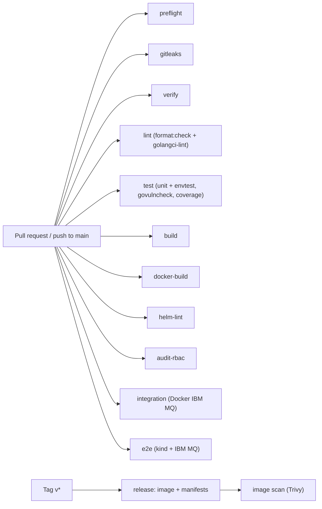

# CI/CD

This document describes the continuous integration and delivery design for
**MKurator**. The guiding principle: **the same checks run locally
(via Task and pre-commit) and in CI**, so "green locally" means "green in CI".

CI runs on **GitHub Actions** per the workflows under `.github/workflows/`
(`preflight.yaml`, `ci.yaml`, `codeql.yaml`, `scorecard.yaml`, `vulncheck.yaml`,
`docs.yaml`, `integration.yaml`, `e2e.yaml`, `nightly.yaml`, `release-gate.yaml`,
`release.yaml`, `renovate.yaml`, `sonarcloud.yaml` — disabled).
This doc is the contract they implement. See [ROADMAP.md](ROADMAP.md) for
delivery context.

**Pipeline health:** **CI**, **Integration**, and **E2E (kustomize)** were green on
`main` before tag **`v0.6.0`** (2026-06-03/04). Tag **`v0.5.2`** predates that
stability — always confirm green workflows on the **exact release SHA** via
[release-gate](RELEASE.md#automated-release-gate-workflow) or `gh run list`.

## Principles

- **Parity**: every CI step maps to a `task` target. No bespoke CI-only logic.
- **Fail fast, fail loud**: lint, codegen drift, test failures, and vuln
  findings all block merge.
- **Reproducible**: tools pinned via `go.mod` `tool` directives; GitHub Actions
  pinned to commit SHAs; `go.sum` committed.
- **Least privilege**: workflows request only the permissions they need;
  registry/release credentials are scoped and only used on protected refs.

## Pipeline overview



All `ci.yaml` jobs run **in parallel** on each PR and `main` push; the diagram lists
what each job runs, not execution order.

## Triggers

| Event | Runs |
|-------|------|
| PR / push to `main` | `preflight.yaml`: `go mod tidy` + `go mod verify` + `task verify` + markdown/shell lint (5 min cap) |
| PR / push to `main` | `ci.yaml`: gitleaks, verify, **audit-rbac**, lint, test, build, docker-build, helm-lint (eight parallel jobs) |
| PR / push to `main` | `codeql.yaml`: Go SAST (weekly schedule + PR/push) |
| Push to `main` | `scorecard.yaml`: OpenSSF Scorecard (weekly schedule + push) |
| Schedule (Mon 04:12 UTC) + `workflow_dispatch` | `vulncheck.yaml`: standalone govulncheck |
| PR / push to `main` (non-docs paths) | `integration.yaml`: Docker IBM MQ integration tests |
| PR / push to `main` (non-docs paths) | `e2e.yaml`: kind + IBM MQ e2e |
| Tag `v*` | `release.yaml`: build + push image, publish install manifests, Trivy scan |
| `workflow_dispatch` | `release-gate.yaml`: re-run verify/test/integration on a SHA and poll until **CI**, **Integration**, and **E2E (kustomize)** check-runs succeeded on that SHA ([RELEASE.md](RELEASE.md)) |
| Schedule (Mon 03:00 UTC) + `workflow_dispatch` | `nightly.yaml`: full integration + e2e (kustomize + optional Helm); not required for merge |
| Schedule (Mon 04:00 UTC) + `workflow_dispatch` | `e2e.yaml` job **`e2e (helm)`** only (standalone Helm deploy path) |
| Schedule (weekly, self-hosted) | `renovate.yaml`: dependency update PRs |

**Path filters:** `integration.yaml` and `e2e.yaml` skip when a push or PR
changes only markdown (`**.md`), `docs/**`, or `charts/**/README.md`. The main
`ci.yaml` workflow runs on every PR and `main` push (no path filters).

### Concurrency

`integration.yaml` and `e2e.yaml` each define a workflow-scoped concurrency
group (`integration-…` / `e2e-…` plus `github.ref`). They do **not** share a
group with `ci.yaml` or each other.

| Workflow | `cancel-in-progress` | Effect |
|----------|----------------------|--------|
| `e2e`, `integration` on **PR** | `true` | A new push cancels the in-flight run for that PR ref (saves runner time). |
| `e2e`, `integration` on **`main`** | `false` | Rapid pushes do not cancel a run already on the cluster; newer runs **queue** until the group is free, so each finished run keeps a visible result. |

`ci.yaml` has no concurrency block (jobs always run in parallel per trigger).

`nightly.yaml` uses a single workflow-scoped group (`nightly-Nightly`) with
`cancel-in-progress: false` so at most one scheduled or manual nightly run is
active; jobs run **sequentially** (`integration` → `e2e (kustomize)` →
`e2e (helm)`) and each step uses `hack/ci/suite-lock.sh` for parity with the
local `exclusive-test.lock` discipline.

`preflight.yaml` has no concurrency block; it runs in parallel with `ci.yaml` and
the heavy workflows.

## Workflow caching

Reusable composite actions under [`.github/actions/`](../.github/actions/) keep
cache keys consistent across workflows. All use pinned `actions/cache@v5.0.5` and
`actions/setup-go@v6.4.0` SHAs (same as `ci.yaml`). We do **not** enable
`setup-go` `cache: true` in addition to the manual module/build cache — that would
duplicate `~/go/pkg/mod` restores.

| Action | Cache key (primary) | Paths | Used in |
|--------|---------------------|-------|---------|
| [`go-cache`](../.github/actions/go-cache/) | `${{ runner.os }}-go-${{ hashFiles('**/go.sum') }}` | `~/.cache/go-build`, `~/go/pkg/mod`; optional envtest: `~/.local/share/kubebuilder-envtest` keyed by `go.mod`+`go.sum` | `ci`, `preflight`, `release-gate`, `integration`, `e2e`, `nightly` |
| [`tools-bin`](../.github/actions/tools-bin/) | `${{ runner.os }}-tools-${{ hashFiles('Taskfile.yml', 'hack/install-external-tool.sh') }}` | `bin/kind`, `bin/mkcert`, `bin/terraform` | `e2e`, `nightly` (e2e jobs) |
| [`mq-docker-image`](../.github/actions/mq-docker-image/) | `${{ runner.os }}-ibm-mq-${{ hashFiles('hack/mq-docker/docker-compose.yml', 'hack/kind-cluster/terraform/variables.tf') }}` | `/tmp/ibm-mq-image.tar` (`docker save`/`load` of `icr.io/ibm-messaging/mq:…`) | `integration`, `e2e`, `nightly` |
| [`helm-cache`](../.github/actions/helm-cache/) | `${{ runner.os }}-helm-${{ hashFiles('hack/kind-cluster/terraform/variables.tf') }}` | `~/.cache/helm` | `e2e`, `nightly` (e2e jobs) |

Image reference for MQ caching is resolved by [`hack/ci/mq-image-ref.sh`](../hack/ci/mq-image-ref.sh)
(must match `hack/mq-docker/docker-compose.yml`). E2e platform bring-up uses
[`hack/ci/cluster-up-with-mq-image.sh`](../hack/ci/cluster-up-with-mq-image.sh):
`kind:up` → `kind load docker-image` → TLS → Terraform (avoids re-pulling MQ inside
kind when the host image is warm).

**Estimated savings (warm cache, typical `ubuntu-latest`):** Go module/build
**~1–3 min** per job; platform tools download **~30–90 s**; IBM MQ image pull
**~3–8 min** on integration/e2e platform steps (warm IBM MQ image on the runner);
Helm chart cache **~30 s–2 min** on first Terraform apply.

`release.yaml` continues to use BuildKit GHA cache for controller image builds
(not the composites above). `charts/mkurator` has no `helm dependency update` step
in CI — nothing to cache beyond the Terraform MQ chart fetch.

## Jobs

### `preflight` (`preflight.yaml`)

Dedicated fail-fast workflow on every PR and `main` push (no path filters). Catches
`go.sum` drift and committed codegen drift in minutes before integration/e2e spend
cluster time.

| Step | Command | Purpose |
|------|---------|---------|
| go mod tidy | `go mod tidy` then `git diff --exit-code go.sum` | Fails when Renovate or local edits leave `go.sum` out of sync |
| verify | `task verify` | Same as `ci.yaml` `verify` — CRDs, RBAC, deepcopy, mocks |

Job timeout: **5 minutes**. Uses [`go-cache`](../.github/actions/go-cache/) (same keys as `ci.yaml`).

Local equivalent: `go mod tidy && git diff --exit-code go.sum` then `task verify`.

Recommend requiring check name **`preflight`** on `main` (fail-fast before
integration/e2e). `ci.yaml` still runs its own **`verify`** job in parallel for
parity.

### `gitleaks`
Secret scan on PRs and `main` pushes (`gitleaks/gitleaks-action` with full git
history).

### `verify`
Regenerates CRDs, RBAC, deepcopy, and **mockery mocks** and fails on any diff
(`task verify` → `hack/verify.sh`). Guarantees committed generated artifacts
never drift.

### `lint`
Runs in order within the job (same runner, no extra wall-clock job):

1. `task format:check` — fails when `gofmt`, `goimports`, or `golines` would change
   any file. Locally, `task format` auto-fixes; pre-commit runs the same formatters.
2. `task lint` — `golangci-lint run ./...`.

### `test`
Runs in order within the job:

1. `task test:run` — Ginkgo unit + envtest with the race detector and a coverage
   profile (`coverage.out`). envtest control-plane binaries come from
   `setup-envtest` (pinned K8s API version in `Taskfile.test.yml`).
2. `task vuln:check` (`govulncheck ./...`) after tests pass. There is no separate
   scheduled govulncheck workflow (Renovate runs weekly).

CI then uploads `coverage.out` as a workflow artifact, prints a **job summary**
(`go tool cover -func`), and publishes to [Codecov](https://codecov.io/gh/conduit-ops/MKurator)
(`codecov.yml`) via `codecov/codecov-action` using the repository secret
`CODECOV_TOKEN` with `fail_ci_if_error: true` (upload failures fail the job;
`codecov.yml` uses `target: auto` only — no strict coverage gate in CI).
Coverage regressions are investigated, not ignored.

### `build`
`task build` — static `CGO_ENABLED=0` manager binary.

### `docker-build`
`task docker:build` — builds the controller-manager container image locally on
the runner (`Dockerfile`; same Go toolchain and build flags as release). Verifies
the image builds on every PR and `main` push; **no registry push** (push, scan,
and signing run only in `release.yaml` on tags).

### `helm-lint`
`task helm:lint` — `helm lint ./charts/mkurator` on the publishable Helm chart,
then [`hack/helm-verify-admission.sh`](../hack/helm-verify-admission.sh) and
[`hack/helm-verify-rbac.sh`](../hack/helm-verify-rbac.sh) to assert rendered
webhook and manager ClusterRole templates stay aligned with
`config/webhook/manifests.yaml` and `config/rbac/role.yaml`.
Runs in parallel with other `ci.yaml` jobs; no cluster or MQ required.

### `integration`
Dedicated workflow [`.github/workflows/integration.yaml`](../.github/workflows/integration.yaml):
[`mq-docker-image`](../.github/actions/mq-docker-image/) → `task mq:integration:up` → `task mq:integration:wait` → `task test:integration`
→ `task mq:integration:down` (always). Exercises `mqadmin.Admin` queue, topic,
channel, **CHLAUTH**, and **AUTHREC** operations against live mqweb without kind.
Local equivalent: `task test:integration:local` or `task ci:integration`.

`hack/ci/run-integration.sh` writes JUnit XML to `artifacts/integration-junit.xml`
(stdlib `go test -json` via pinned `go-junit-report`). The workflow uploads it as
an artifact on every run (`if: always()`).

### `e2e`
Dedicated workflow [`.github/workflows/e2e.yaml`](../.github/workflows/e2e.yaml):

- **`e2e (kustomize)`** — every qualifying PR and `main` push: platform up →
  `task test:e2e` with `KURATOR_E2E_MQ=1`, parallel Ginkgo (`KURATOR_E2E_NODES=3`),
  and PR label filter `(smoke || mq) && !slow` (manager smoke + MQ happy paths;
  skips metrics and QMC rotation). On **`main` push**, the same job then runs
  `task test:e2e:helm` on the existing cluster (no second `cluster:up`).
- **`e2e (helm)`** — `workflow_dispatch` and weekly cron only (not PRs): dedicated
  platform, then `task test:e2e:helm` (`KURATOR_E2E_DEPLOY=helm`).

Both jobs use workflow caches (Go, platform tools, IBM MQ image, Helm) per
[Workflow caching](#workflow-caching), `CERT_MANAGER_INSTALL_SKIP=true` (cert-manager from Terraform) and
`task cluster:down` (always). Local: `task ci:e2e`; kustomize + Helm on one cluster:
`KURATOR_CI_E2E_BOTH=1 task ci:e2e`.

`hack/ci/run-e2e.sh` emits Ginkgo JUnit to `artifacts/e2e-junit.xml`
(`go tool ginkgo run --junit-report`); each e2e job uploads that file as a workflow artifact
(`if: always()`). PR job summaries from JUnit are not generated yet.

### `nightly` (scheduled + manual)

Dedicated workflow [`.github/workflows/nightly.yaml`](../.github/workflows/nightly.yaml):
flake detection and full-suite signal **without** blocking PRs. Not listed in
branch protection.

| Job | Command / flow | Notes |
|-----|----------------|-------|
| `integration` | `bash hack/ci/suite-lock.sh exclusive-test task ci:integration` | Same as `integration.yaml` (Docker MQ up → tests → down) |
| `e2e (kustomize)` | `suite-lock` → `hack/ci/cluster-up-with-mq-image.sh` → `hack/ci/wait-mqweb.sh` → `task test:e2e` | `KURATOR_E2E_MQ=1`; no `!slow` label filter |
| `e2e (helm)` | Same platform steps → `task test:e2e:helm` | `KURATOR_E2E_DEPLOY=helm`; skipped on `workflow_dispatch` when `run_helm_e2e` is false; always runs on schedule |

Workflow timeout per job: **120 minutes**. On failure, uploads diagnostics
(`.state/` kubeconfig artifacts, `kubectl` pod/log dumps, Docker MQ logs for
integration). Trigger: cron **Monday 03:00 UTC** or `workflow_dispatch`.

Local parity (sequential, one host — respect `exclusive-test.lock`):

```sh
task ci:integration
task cluster:up && bash hack/ci/wait-mqweb.sh && KURATOR_E2E_MQ=1 task test:e2e && task cluster:down
# optional second cluster cycle for Helm:
task cluster:up && bash hack/ci/wait-mqweb.sh && KURATOR_E2E_DEPLOY=helm task test:e2e:helm && task cluster:down
```

Or kustomize + Helm on one cluster: `KURATOR_CI_E2E_BOTH=1 task ci:e2e`.

### `release-gate` (`workflow_dispatch` only)

Dedicated workflow [`.github/workflows/release-gate.yaml`](../.github/workflows/release-gate.yaml)
for maintainers **before tagging** (see [RELEASE.md](RELEASE.md#automated-release-gate-workflow)):

| Job | What it does |
|-----|----------------|
| `resolve sha` | Target commit (input or latest `main` HEAD) |
| `verify (release gate)` | `task verify` on that SHA |
| `test (release gate)` | `task test:run` on that SHA |
| `integration (release gate)` | Docker MQ `task ci:integration` on that SHA |
| `wait for external checks` | Polls GitHub check-runs until **`gitleaks`**, **`verify`**, **`lint`**, **`test`**, **`build`**, **`docker-build`**, **`helm-lint`**, **`integration`**, and **`e2e (kustomize)`** succeeded on the same SHA |

E2E is **not** executed inside this workflow (~90 min); the poll step requires an
existing green **E2E (kustomize)** run whose `headSha` matches the gate SHA. Standalone
**`e2e (helm)`** is optional for tagging. Uses [`hack/ci/wait-release-gate-checks.sh`](../hack/ci/wait-release-gate-checks.sh).
Not a branch-protection check.

### `release` (tags only)
Builds and pushes the multi-arch controller image to GHCR with **OCI SBOM** and
**SLSA provenance** attestations, scans with Trivy, **cosign-signs** the image
digest (keyless OIDC), generates an SPDX SBOM (`dist/sbom.spdx.json`), packages
release assets via [`hack/release-assets.sh`](../hack/release-assets.sh)
(Kustomize manifests, Helm `.tgz`, checksums), **pushes the Helm chart to GHCR
OCI** (`helm push` → `oci://ghcr.io/<owner>/mkurator:<version>`; reuses the
existing GHCR login — no extra token step), then publishes the same install
artifacts on the GitHub Release. Runs only on `v*.*.*` tags (or
`workflow_dispatch` for testing).

**Changelog:** [git-cliff](https://git-cliff.org/) (`cliff.toml`) generates the
release-notes section from Conventional Commits since the previous tag
(`orhun/git-cliff-action`, pinned to the same version as `task tools:git-cliff`).
Install instructions are appended from [`.github/release-notes-install.md`](../.github/release-notes-install.md)
via [`hack/assemble-release-notes.sh`](../hack/assemble-release-notes.sh). Checkout
uses `fetch-depth: 0` so tag ranges resolve correctly.

Maintainer steps: [RELEASE.md](RELEASE.md). Before tagging: `task changelog` (preview),
bump `charts/mkurator/Chart.yaml`, `task changelog:write`, commit, then run
**Release gate** (`workflow_dispatch`) or manually confirm **CI**, **Integration**,
and **E2E (kustomize)** are green on the **exact commit SHA** you will tag (do not
tag ahead of a red pipeline — see historical note for `v0.5.2` in [ROADMAP.md](ROADMAP.md)).
`git tag vX.Y.Z && git push origin vX.Y.Z`. Rationale: [ADR-0008](adr/0008-changelog-git-cliff.md).
Supply chain: [ADR-0016](adr/0016-release-supply-chain.md).

### image scan
**Trivy** scans the built image for OS/dependency vulnerabilities on release;
documented false positives live in `.trivyignore` with a rationale comment.
Critical/high findings fail the job.

## Caching (legacy note)

Go module/build and envtest caches are implemented via the composite
[`go-cache`](../.github/actions/go-cache/) action (see [Workflow caching](#workflow-caching)).
IBM MQ image reuse uses [`mq-docker-image`](../.github/actions/mq-docker-image/);
controller **docker-build** in CI does not use BuildKit layer cache (release workflow does).

## Security & supply chain

| Control | Mechanism |
|---------|-----------|
| Secret scan | gitleaks (pre-commit + CI) |
| Dependency vulns | `govulncheck` on PR / `main` push (in `test` job) |
| Image vulns | Trivy scan on release image |
| Dependency freshness | **Renovate** weekly workflow (`renovate.yaml`) |
| Pinned actions | GitHub Actions referenced by commit SHA |
| Node 24 runtime | Third-party actions bumped to Node 24 releases where available; `arduino/setup-task@v2.0.0` (no Node 24 tag yet) uses workflow `FORCE_JAVASCRIPT_ACTIONS_TO_NODE24: true` in `ci.yaml`, `integration.yaml`, and `e2e.yaml` |
| Minimal permissions | `permissions:` block per workflow; default read-only |
| Reproducible build | CGO-free, pinned toolchain, committed `go.sum` |
| Nonroot runtime | distroless nonroot base, read-only FS, dropped caps |
| Release SBOM | BuildKit attestation on push + SPDX file on GitHub Release |
| Image signing | cosign keyless (`sigstore/cosign-installer`) on image digest |
| SLSA provenance | `provenance: mode=max` on `docker/build-push-action` |
| Helm chart (OCI) | `helm push` to `oci://ghcr.io/<owner>/mkurator` on tag (GHCR package) |

Further supply-chain hardening (OpenSSF Scorecard, SLSA Level 3 builders) remains
optional; see [ADR-0005](adr/0005-keep-tooling-lean.md).

### Renovate (dependency freshness)

Weekly dependency update PRs are driven by
[`.github/workflows/renovate.yaml`](../.github/workflows/renovate.yaml) using
[`renovatebot/github-action`](https://github.com/renovatebot/github-action).

Configuration is split on purpose:

| File | Role |
|------|------|
| [`.github/renovate-config.json`](../.github/renovate-config.json) | **Global** (self-hosted) config passed to the action: target repo via `RENOVATE_REPOSITORIES`, onboarding disabled |
| [`renovate.json`](../renovate.json) | **Repository** config: schedules, grouping, custom managers, package rules |

**Maintainer setup:** add a repository secret `RENOVATE_TOKEN` — a classic
[Personal Access Token](https://docs.github.com/en/authentication/keeping-your-account-and-data-secure/managing-your-personal-access-tokens)
with:

- **Private repo:** `repo` + `workflow` scopes
- **Public repo:** `public_repo` + `workflow` scopes

The workflow falls back to `github.token` when `RENOVATE_TOKEN` is unset, but
that token is **not sufficient** for the `github-actions` manager: updating
pinned action SHAs in workflow files requires the `workflow` scope, which the
default `GITHUB_TOKEN` does not grant to third-party actions. Without
`RENOVATE_TOKEN`, Go/module/Docker bumps may still open PRs, but GitHub Actions
pin updates will fail or be skipped.

The job sets `RENOVATE_REPOSITORIES: ${{ github.repository }}` so Renovate knows
which repo to scan (global-only; do not put `autodiscover` in `renovate.json`).
Workflow file updates rely on the PAT `workflow` scope on `RENOVATE_TOKEN`, not
on `GITHUB_TOKEN` job permissions.
`LOG_LEVEL=debug` is enabled only on manual `workflow_dispatch` runs.

## Branch protection

Recommended **required status checks** for `main` (names match `jobs.<id>.name` in
the workflow files). No direct pushes to `main`.

### Require on every PR and `main` push

| Check name | Workflow | What it runs |
|------------|----------|--------------|
| `preflight` | Preflight | `go mod tidy` + `go mod verify` + `task verify` + markdown/shell lint (5 min timeout) |
| `gitleaks` | CI | Secret scan |
| `verify` | CI | `task verify` (CRDs, RBAC, deepcopy, mocks) |
| `audit-rbac` | CI | `hack/audit-rbac.sh` (Polaris + kubeaudit on `config/rbac/`) |
| `lint` | CI | `task format:check` then `task lint` |
| `test` | CI | `task test:run`, `task vuln:check`, Codecov upload |
| `build` | CI | `task build` |
| `docker-build` | CI | `task docker:build` |
| `helm-lint` | CI | `task helm:lint` |

### Require when path filters run (non-docs changes)

| Check name | Workflow | What it runs |
|------------|----------|--------------|
| `integration` | Integration | Docker IBM MQ + `task test:integration` + JUnit artifact |

Skipped when a PR changes only `**.md`, `docs/**`, or `charts/**/README.md`.
Docs-only PRs need **`preflight`** plus the eight **`ci.yaml`** jobs only.

### E2E — optional on PRs, recommended on `main` when stable

| Check name | PRs | `main` | Notes |
|------------|-----|--------|-------|
| `e2e (kustomize)` | **Optional** required check | **Recommended** required check once green | PRs use `(smoke \|\| mq) && !slow`; `main` runs full suite then Helm on same cluster |
| `e2e (helm)` | Not run | Cron/dispatch/nightly only | Do not require for merge |

Do **not** add **`nightly`** or **Release gate** jobs to branch protection (maintainer
/ flake signal only). Do not require **`e2e (kustomize)`** on PRs until the team accepts
~90 min merge latency; still runs on every qualifying PR unless cancelled.

Until e2e is consistently green on `main`, keep **`e2e (kustomize)`** off required
checks and use [release-gate](RELEASE.md#automated-release-gate-workflow) before tags.

### Legacy names to remove

If branch protection still lists retired job names, delete them and use the table
above:

| Remove (old) | Replaced by |
|--------------|-------------|
| `format` | `lint` (`task format:check` runs inside `lint`) |
| `govulncheck` | `test` (`task vuln:check` runs inside `test`) |

## Local equivalents

| CI job | Local command |
|--------|---------------|
| preflight | `go mod tidy && git diff --exit-code go.sum` · `go mod verify` · `task verify` · `task lint:markdown` · `task lint:shell` |
| gitleaks | `task secrets:scan` |
| verify | `task verify` (includes `task test:schema` / `make test-schema`) |
| audit-rbac | `task audit:rbac` |
| lint | `task format:check` then `task lint` |
| test | `task test:run` then `task vuln:check` |
| build | `task build` |
| docker-build | `task docker:build` |
| helm-lint | `task helm:lint` (includes `hack/helm-verify-rbac.sh` for RBAC drift) |
| integration | `task ci:integration` (or `task test:integration:local`) |
| e2e | `task ci:e2e` (or `task cluster:up && KURATOR_E2E_MQ=1 task test:e2e`) |
| nightly | `task ci:integration` then e2e steps above (or `KURATOR_CI_E2E_BOTH=1 task ci:e2e` for one-cluster Helm) |
| release-gate | Actions → **Release gate** → Run workflow on SHA ([RELEASE.md](RELEASE.md)) |
| release changelog | `task changelog` / `task changelog:write` |

pre-commit runs `gofmt`/`goimports`, `golangci-lint`, and `task verify` so most
CI failures are caught before pushing.
