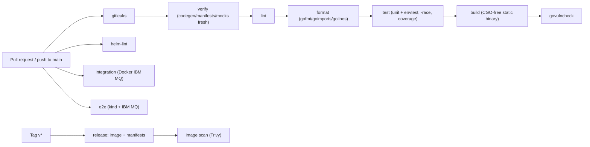

# CI/CD

This document describes the continuous integration and delivery design for
**Kurator**. The guiding principle: **the same checks run locally
(via Task and pre-commit) and in CI**, so "green locally" means "green in CI".

CI runs on **GitHub Actions** per the workflows under `.github/workflows/`
(`ci.yaml`, `integration.yaml`, `e2e.yaml`, `release.yaml`, `renovate.yaml`).
This doc is the contract they implement. See [ROADMAP.md](ROADMAP.md) for
delivery context.

## Principles

- **Parity**: every CI step maps to a `task` target. No bespoke CI-only logic.
- **Fail fast, fail loud**: lint, codegen drift, test failures, and vuln
  findings all block merge.
- **Reproducible**: tools pinned via `go.mod` `tool` directives; GitHub Actions
  pinned to commit SHAs; `go.sum` committed.
- **Least privilege**: workflows request only the permissions they need;
  registry/release credentials are scoped and only used on protected refs.

## Pipeline overview

## Triggers

| Event | Runs |
|-------|------|
| PR / push to `main` | `ci.yaml`: gitleaks, verify, lint, format, test, build, govulncheck, helm-lint |
| PR / push to `main` (non-docs paths) | `integration.yaml`: Docker IBM MQ integration tests |
| PR / push to `main` (non-docs paths) | `e2e.yaml`: kind + IBM MQ e2e |
| Tag `v*` | `release.yaml`: build + push image, publish install manifests, Trivy scan |
| Schedule (weekly, self-hosted) | `renovate.yaml`: dependency update PRs |

**Path filters:** `integration.yaml` and `e2e.yaml` skip when a push or PR
changes only markdown (`**.md`), `docs/**`, or `charts/**/README.md`. The main
`ci.yaml` workflow runs on every PR and `main` push (no path filters).

## Jobs

### `gitleaks`
Secret scan on PRs and `main` pushes (`gitleaks/gitleaks-action` with full git
history).

### `verify`
Regenerates CRDs, RBAC, deepcopy, and **mockery mocks** and fails on any diff
(`task verify` → `hack/verify.sh`). Guarantees committed generated artifacts
never drift.

### `lint`
`task lint` — `golangci-lint run ./...`.

### `format`
`task format:check` — fails when `gofmt`, `goimports`, or `golines` would change
any file. Locally, `task format` auto-fixes; pre-commit runs the same formatters.

### `test`
`task test:run` — Ginkgo unit + envtest with the race detector and a coverage
profile (`coverage.out`). envtest control-plane binaries come from
`setup-envtest` (pinned K8s API version in `Taskfile.test.yml`). CI uploads
`coverage.out` as a workflow artifact, prints a **job summary** (`go tool cover
-func`), and publishes to [Codecov](https://codecov.io/gh/konih/kurator)
(`codecov.yml`) via `codecov/codecov-action` using the repository secret
`CODECOV_TOKEN`. A regression is investigated, not ignored.

### `build`
`task build` — static `CGO_ENABLED=0` manager binary. **Docker image builds run
only on release tags** (`release.yaml`), not on PRs.

### `govulncheck`
`task vuln:check` (`govulncheck ./...`) on PRs and `main` pushes. There is no
separate scheduled govulncheck workflow (Renovate runs weekly).

### `helm-lint`
`task helm:lint` — `helm lint ./charts/kurator` on the publishable Helm chart.
Runs in parallel with other `ci.yaml` jobs; no cluster or MQ required.

### `integration`
Dedicated workflow [`.github/workflows/integration.yaml`](../.github/workflows/integration.yaml):
`task mq:integration:up` → `task mq:integration:wait` → `task test:integration`
→ `task mq:integration:down` (always). Exercises `mqadmin.Admin` queue, topic,
channel, **CHLAUTH**, and **AUTHREC** operations against live mqweb without kind.
Local equivalent: `task test:integration:local` or `task ci:integration`.

### `e2e`
Dedicated workflow [`.github/workflows/e2e.yaml`](../.github/workflows/e2e.yaml):
`task tools:install` → `task cluster:up` (kind + Terraform + IBM MQ) →
`hack/ci/wait-mqweb.sh` → `task test:e2e` with `KURATOR_E2E_MQ=1` and
`CERT_MANAGER_INSTALL_SKIP=true` (cert-manager is already installed by
Terraform) → `task cluster:down` (always). Local equivalent: `task ci:e2e`.

### `release` (tags only)
Builds and pushes the multi-arch controller image to GHCR with **OCI SBOM** and
**SLSA provenance** attestations, scans with Trivy, **cosign-signs** the image
digest (keyless OIDC), generates an SPDX SBOM (`dist/sbom.spdx.json`), then
publishes Kustomize/Helm install manifests on the GitHub Release. Runs only on
`v*.*.*` tags (or `workflow_dispatch` for testing).

**Changelog:** [git-cliff](https://git-cliff.org/) (`cliff.toml`) generates the
release-notes section from Conventional Commits since the previous tag
(`orhun/git-cliff-action`, pinned to the same version as `task tools:git-cliff`).
Install instructions are appended from [`.github/release-notes-install.md`](../.github/release-notes-install.md)
via [`hack/assemble-release-notes.sh`](../hack/assemble-release-notes.sh). Checkout
uses `fetch-depth: 0` so tag ranges resolve correctly.

Maintainer steps: [RELEASE.md](RELEASE.md). Before tagging: `task changelog` (preview),
bump `charts/kurator/Chart.yaml`, `task changelog:write`, commit, then
`git tag vX.Y.Z && git push origin vX.Y.Z`. Rationale: [ADR-0008](adr/0008-changelog-git-cliff.md).
Supply chain: [ADR-0016](adr/0016-release-supply-chain.md).

### image scan
**Trivy** scans the built image for OS/dependency vulnerabilities on release;
documented false positives live in `.trivyignore` with a rationale comment.
Critical/high findings fail the job.

## Caching

Go-heavy jobs in `ci.yaml` and the `integration` workflow restore and save
`actions/cache` entries keyed on `go.sum`:

| Cache | Path | Jobs |
|-------|------|------|
| Go modules + build cache | `~/go/pkg/mod`, `~/.cache/go-build` | verify, lint, format, test, build, govulncheck, integration |
| envtest binaries | `~/.local/share/kubebuilder-envtest` | test only |

The envtest cache key includes the pinned K8s version (`1.35.x`, from
`Taskfile.test.yml`) so a version bump invalidates stale binaries. Docker layer
caching is not configured (integration/e2e pull IBM MQ images on each run).

## Security & supply chain

| Control | Mechanism |
|---------|-----------|
| Secret scan | gitleaks (pre-commit + CI) |
| Dependency vulns | `govulncheck` on PR / `main` push |
| Image vulns | Trivy scan on release image |
| Dependency freshness | **Renovate** weekly workflow (`renovate.yaml`) |
| Pinned actions | GitHub Actions referenced by commit SHA |
| Minimal permissions | `permissions:` block per workflow; default read-only |
| Reproducible build | CGO-free, pinned toolchain, committed `go.sum` |
| Nonroot runtime | distroless nonroot base, read-only FS, dropped caps |
| Release SBOM | BuildKit attestation on push + SPDX file on GitHub Release |
| Image signing | cosign keyless (`sigstore/cosign-installer`) on image digest |
| SLSA provenance | `provenance: mode=max` on `docker/build-push-action` |

Further supply-chain hardening (OpenSSF Scorecard, SLSA Level 3 builders) remains
optional; see [ADR-0005](adr/0005-keep-tooling-lean.md).

## Branch protection

The default branch requires CI jobs to pass before merge. Exact required checks
depend on GitHub branch protection settings; `e2e` and `integration` run on every
non-docs PR today. No direct pushes to the default branch.

## Local equivalents

| CI job | Local command |
|--------|---------------|
| gitleaks | `task secrets:scan` |
| verify | `task verify` |
| lint | `task lint` |
| format | `task format` / `task format:check` |
| test | `task test:run` |
| build | `task build` |
| govulncheck | `task vuln:check` |
| helm-lint | `task helm:lint` |
| integration | `task ci:integration` (or `task test:integration:local`) |
| e2e | `task ci:e2e` (or `task cluster:up && KURATOR_E2E_MQ=1 task test:e2e`) |
| release changelog | `task changelog` / `task changelog:write` |

pre-commit runs `gofmt`/`goimports`, `golangci-lint`, and `task verify` so most
CI failures are caught before pushing.
