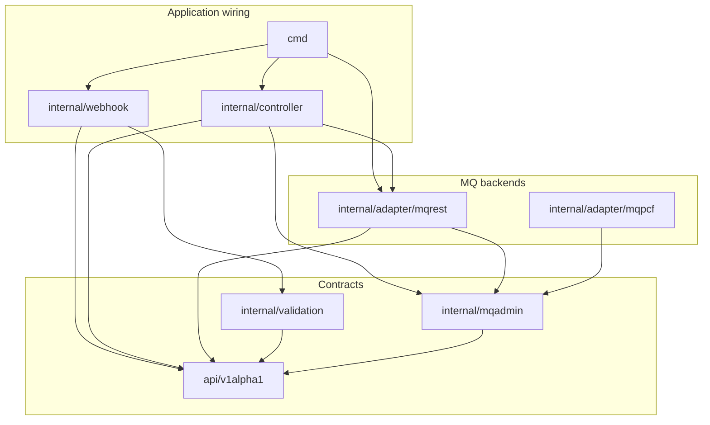
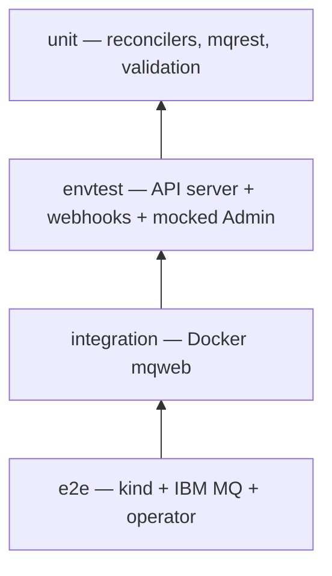

# Go module layout

How the **MKurator** codebase is organized as a Go module: import paths, package
layers, generated artifacts, and how tests map to those layers. For runtime
behaviour (manager, reconcilers, webhooks) see
[OPERATOR_RUNTIME.md](OPERATOR_RUNTIME.md). For the product-level design see
[ARCHITECTURE.md](ARCHITECTURE.md).

## Module identity

| Item | Value |
|------|--------|
| **Module path** | `github.com/conduit-ops/MKurator` |
| **API group** | `messaging.mkurator.dev` |
| **API version** | `v1alpha1` |
| **Entrypoint** | `cmd/main.go` |
| **Go version** | Floor in `go.mod` (`go` directive); CI uses the pinned toolchain via `GOTOOLCHAIN` |

The Git repository is [conduit-ops/MKurator](https://github.com/conduit-ops/MKurator); a local
clone may use another directory name (for example `IBM-Message-Queue-Operator`).

## Repository map (Go packages)

```
.
├── api/v1alpha1/              # CRD types, conditions, finalizer constants
├── cmd/                       # Manager bootstrap (scheme, reconcilers, webhooks)
├── internal/
│   ├── controller/            # Reconcilers + shared reconcile helpers
│   ├── mqadmin/               # MQAdmin port (Admin, Factory, domain specs, errors)
│   ├── adapter/
│   │   ├── mqrest/            # mqweb REST implementation of MQAdmin (production)
│   │   └── mqpcf/             # PCF stub / future backend (not wired in main)
│   ├── webhook/v1alpha1/      # Validating admission handlers
│   ├── validation/            # Pure validation rules (shared with webhooks)
│   ├── health/                # Readiness: at least one Ready QMC
│   ├── logging/               # slog/logr bootstrap
│   └── metrics/               # Prometheus reconcile metrics
├── test/
│   ├── mocks/                 # mockery-generated mqadmin mocks
│   ├── integration/         # Live mqweb (build tag integration)
│   ├── e2e/                   # kind + operator (build tag e2e)
│   ├── schema/                # CRD OpenAPI golden contract tests
│   └── utils/                 # Shared e2e/envtest helpers
└── config/                    # Kustomize CRDs, RBAC, manager, webhook (not Go)
```

Helm (`charts/mkurator/`) and Kustomize (`config/`) deploy the same binary; they
are not part of the module graph but consume generated CRDs and RBAC.

## Layered dependency model

Dependencies flow **inward**: Kubernetes API types and the MQAdmin port sit at
the center; adapters and controllers depend on them, not the reverse.



### Layer rules (intended)

These rules match how the code is written today and what `task lint` / review
expect. Run `task arch:lint` (go-arch-lint) via `task lint` — config at
[`hack/tooling/go-arch-lint.yml`](../hack/tooling/go-arch-lint.yml).

| Layer | May import | Must not import |
|-------|------------|-----------------|
| **`api/v1alpha1`** | `k8s.io/*`, `sigs.k8s.io/controller-runtime/pkg/scheme` | `internal/*`, `cmd`, adapters |
| **`internal/validation`** | `api`, `k8s.io/apimachinery` | `controller`, `mqrest`, `mqadmin` |
| **`internal/mqadmin`** | `api` (for `Factory` signatures), stdlib | `mqrest`, `controller`, `webhook` |
| **`internal/adapter/mqrest`** | `mqadmin`, `api`, `k8s.io/client-go` | `controller`, `webhook` |
| **`internal/controller`** | `mqadmin`, `api`, `metrics`; **`mqrest` for MQSC formatting only** (`Format*MQSC`) | Direct HTTP / TLS to mqweb |
| **`internal/webhook`** | `validation`, `api`, controller-runtime webhook | `mqadmin`, `mqrest` |
| **`cmd`** | All of the above for wiring | Business logic (keep thin) |

**Pragmatic exception:** workload reconcilers call `mqrest.Format*MQSC` to populate
`status.desiredMQSC` without duplicating MQSC templates. MQ mutations still go
through `mqadmin.Admin` only ([ADR-0014](adr/0014-mq-error-taxonomy-and-requeue.md)).

Reconcilers never call `RunMQSC` on the REST client; that escape hatch exists for
integration/e2e fixtures, not production reconcile paths.

### Supporting packages

| Package | Role |
|---------|------|
| `internal/health` | `readyz`: no QMCs, or at least one `Ready=True` |
| `internal/logging` | Load config; bridge to controller-runtime `logr` |
| `internal/metrics` | Per-controller reconcile success/error counters |

## The MQAdmin port

`internal/mqadmin` defines the only MQ surface reconcilers use:

- **`Factory`** — `ForConnection`, `ReleaseConnection` (client cache; see
  [OPERATOR_RUNTIME.md](OPERATOR_RUNTIME.md#connection-client-cache)).
- **`Admin`** — typed operations: `Ping`, queue/topic/channel CRUD, `Set/Get/Delete`
  channel auth, `Set/Get/Delete` authority records.
- **Domain specs** — `QueueSpec`, `TopicSpec`, `ChannelSpec`, `ChannelAuthSpec`,
  `AuthoritySpec` (decoupled from CRD field names).
- **Errors** — `TerminalError`, `TransientError`, `NotFoundError` with `errors.Is`
  sentinels (`ErrTerminal`, `ErrTransient`, `ErrNotFound`).

`internal/adapter/mqrest` is the sole `Factory` implementation registered in
`cmd/main.go`. `internal/adapter/mqpcf` is a separate package for a future PCF
backend ([ADR-0017](adr/0017-pcf-adapter-behind-mqadmin.md)).

## Generated and committed artifacts

Regenerate with `task generate && task manifests`; CI and pre-commit run
`task verify` to fail on drift.

| Artifact | Generator | Location |
|----------|-----------|----------|
| Deepcopy | `controller-gen object` | `api/v1alpha1/zz_generated.deepcopy.go` |
| CRDs | `controller-gen crd` | `config/crd/bases/*.yaml` |
| RBAC / webhook config | `controller-gen rbac,webhook` | `config/rbac/`, `config/webhook/` |
| `MQAdmin` mock | mockery (`.mockery.yaml`) | `test/mocks/` |
| OpenAPI spec goldens | `task test:schema:update` | `test/schema/golden/*.openapi.yaml` |

Kubebuilder markers on API types and `+kubebuilder:rbac` on reconcilers drive
CRD and ClusterRole generation. Do not hand-edit generated files without
regenerating.

## Testing pyramid

Aligned with [ADR-0011](adr/0011-layered-testing-strategy.md) and
[DEVELOPMENT.md](DEVELOPMENT.md#test-tiers).



| Tier | Packages / paths | MQ / cluster | Command |
|------|------------------|--------------|---------|
| **Unit** | `internal/controller/*_test.go`, `internal/adapter/mqrest`, `internal/validation`, `internal/webhook` (table tests) | Mock `mqadmin.Admin`; `httptest` for REST | `task test:run` |
| **envtest** | `*_envtest_test.go`, `suite_test.go` under `internal/controller`, `internal/webhook` | Real API server; mocked `Admin`; CRDs from `config/` | `task test:run` |
| **Schema contract** | `test/schema` | None — compares CRD OpenAPI fragments to goldens | `task test:schema` (via `task verify`) |
| **Integration** | `test/integration/mq/*_integration_test.go` | Docker IBM MQ; tag `integration`, env `KURATOR_INTEGRATION_MQ=1` | `task test:integration` |
| **e2e** | `test/e2e` | kind + QM; tag `e2e`, env `KURATOR_E2E_MQ=1` | `task test:e2e` |

**Rules of thumb:**

- Reconciler or status/event changes → unit + envtest in `task test:run`.
- `mqrest` HTTP/MQSC parsing or auth paths → add or extend integration tests.
- Install/upgrade or cross-CR wiring → e2e when feasible.
- CRD/kubebuilder marker changes → update `test/schema` goldens (`task test:schema:update`).

Host lock: only one of `test:e2e`, `test:e2e:helm`, `ci:e2e`, or
`test:integration` at a time per machine (`hack/ci/suite-lock.sh`).

## See also

- [OPERATOR_RUNTIME.md](OPERATOR_RUNTIME.md) — manager startup, reconcile loops, webhooks
- [ARCHITECTURE.md](ARCHITECTURE.md) — scope, security, CR examples, local topology
- [ATTRIBUTE_RECONCILIATION.md](ATTRIBUTE_RECONCILIATION.md) — drift matrices
- [IBM_MQ_REST_API.md](IBM_MQ_REST_API.md) — mqweb usage in the adapter
