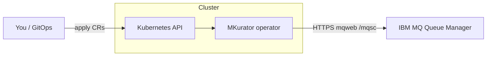

# Install and use MKurator

This guide is for **operators and application teams** who want to install MKurator
on Kubernetes and manage IBM MQ objects declaratively. It assumes you already
have a running **IBM MQ queue manager** with the **Administrative REST API**
(`mqweb`) enabled. MKurator does **not** install or scale queue managers.

For contributor setup (kind, tests, codegen), see [DEVELOPMENT.md](DEVELOPMENT.md).

Doc index: [README.md](README.md) · [../README.md](../README.md)

## On this page

| | Section |
|---|---------|
| 📦 | [What you get](#what-you-get) |
| ✅ | [Before you install](#before-you-install) |
| ⬇️ | [Install the operator](#install-the-operator) |
| 🚀 | [Quick start: one queue](#quick-start-one-queue-on-your-queue-manager) |
| ⚙️ | [How it works](#how-it-works) |
| 📖 | [Resource reference](#resource-reference) |
| 🔧 | [Sample resources](#sample-resources-in-this-repository) |
| 📅 | [Day-2 operations](#day-2-operations) |
| 📊 | [Metrics and monitoring](OBSERVABILITY.md) |
| ⬆️ | [Upgrading from a previous release](#upgrading-from-a-previous-release) |
| 🆘 | [Diagnostics and troubleshooting](#diagnostics-and-troubleshooting) |
| 🗑️ | [Uninstall](#uninstall) |
| ➡️ | [Next steps](#next-steps) |

## What you get

| Custom resource | Short name | Purpose |
|-----------------|------------|---------|
| `QueueManagerConnection` | `qmc` | How to reach one queue manager (endpoint, TLS, credentials) |
| `Queue` | `mq` | Local, alias, or remote queue (`QLOCAL` / `QALIAS` / `QREMOTE`) |
| `Topic` | `tp` | An administrative topic object (`DEFINE TOPIC`) |
| `Channel` | `chl` | A server-connection channel (`CHLTYPE(SVRCONN)`) |
| `ChannelAuthRule` | `car` | A channel authentication rule (`SET CHLAUTH`) |
| `AuthorityRecord` | `auth` | An OAM authority record (`SET AUTHREC`) |

The operator translates desired state into MQSC via `mqweb`, reports **conditions**
on each resource, and removes MQ objects when you delete a CR (finalizers).

**v1alpha1 scope:** queue `spec.type` supports `local` (default), `alias`, and
`remote`. `ChannelAuthRule` samples cover `ADDRESSMAP` and `BLOCKUSER`; other
`ruleType` values are accepted by the API and validated at MQ apply time.
Auth drift uses GET/replace (not queue/topic/channel DISPLAY matrices) — see
[ATTRIBUTE_RECONCILIATION.md](ATTRIBUTE_RECONCILIATION.md).

Sample manifests with field notes: [config/samples/README.md](../config/samples/README.md).

CR summary and release identity: [README.md#what-ships-in-v1alpha1-today](../README.md#what-ships-in-v1alpha1-today).
Test coverage: [README.md#what-ci-proves](../README.md#what-ci-proves) and
[DEVELOPMENT.md#test-tiers](DEVELOPMENT.md#test-tiers).

---

## Before you install

### Cluster requirements

- Kubernetes **1.29+** (CRD CEL validation for admission rules; see [ADR-0025](adr/0025-cel-first-admission-validation.md))
- `kubectl` configured for your cluster
- Network path from the MKurator pod to your queue manager’s **mqweb HTTPS port**
  (typically `9443`)
- **[cert-manager](https://cert-manager.io/)** — required when validating webhooks are
  enabled (the default). The chart/manifests create webhook TLS via cert-manager
  `Issuer` + `Certificate`; verify cert-manager is healthy and the serving
  certificate becomes `Ready` before relying on admission. Stateless field rules
  are enforced by CRD CEL in the API server, so you can install with
  `webhooks.enabled=false` without cert-manager (referential checks then run at
  reconcile time only — see [How it works](#how-it-works)).

### Queue manager requirements

- IBM MQ with **mqweb** and the **REST administration API** (v3 path:
  `/ibmmq/rest/v3/...`)
- An MQ administrator account that can run administrative MQSC (`DEFINE`,
  `DISPLAY`, `DELETE` on queues)
- TLS: either a CA you trust, or (development only) explicit skip-verify

### Recommended layout

Install the **operator** into a dedicated namespace (for example
`mkurator-system`). Put **`QueueManagerConnection` and all workload CRs** (`Queue`, `Topic`,
`Channel`, `ChannelAuthRule`, `AuthorityRecord`) **in the same namespace** as the credentials `Secret` they
reference — typically that same `mkurator-system` namespace, or a team namespace
where you store MQ connection secrets.

---

## Install the operator

Pick one method. All paths install the same CRDs and controller.

### Option A — GitHub Release manifests (Kustomize)

Download the release tag you intend to run from
[GitHub Releases](https://github.com/conduit-ops/MKurator/releases). The examples below
use **`0.7.1`** (or the tag you downloaded from GitHub Releases). Older tags
(before `v0.5.0`) do not include `ChannelAuthRule` and `AuthorityRecord`; check
release notes before upgrading.

```sh
VERSION=0.7.1   # replace with your release tag
curl -sLO "https://github.com/conduit-ops/MKurator/releases/download/v${VERSION}/install-crds.yaml"
curl -sLO "https://github.com/conduit-ops/MKurator/releases/download/v${VERSION}/install.yaml"

kubectl apply -f install-crds.yaml
kubectl apply -f install.yaml
```

Verify:

```sh
kubectl -n mkurator-system rollout status deployment/mkurator-controller-manager
kubectl -n mkurator-system wait --for=condition=Ready certificate/webhook-server-cert --timeout=120s
kubectl get crd | grep messaging.mkurator.dev
```

The release `install.yaml` pins the controller image to
`ghcr.io/conduit-ops/mkurator:<version>`.

### Option B — Helm chart (GitHub Release tarball)

```sh
VERSION=0.7.1
curl -sLO "https://github.com/conduit-ops/MKurator/releases/download/v${VERSION}/mkurator-${VERSION}.tgz"

helm upgrade --install mkurator "mkurator-${VERSION}.tgz" \
  --namespace mkurator-system \
  --create-namespace \
  --set image.repository=ghcr.io/conduit-ops/mkurator \
  --set image.tag="${VERSION}"
```

### Option C — Helm chart (OCI registry on GHCR)

```sh
VERSION=0.7.1
helm upgrade --install mkurator oci://ghcr.io/conduit-ops/mkurator \
  --version "${VERSION}" \
  --namespace mkurator-system \
  --create-namespace \
  --set image.repository=ghcr.io/conduit-ops/mkurator \
  --set image.tag="${VERSION}"
```

### Option D — From this repository (development)

```sh
task deploy          # Kustomize: config/default + CRDs
# or
task deploy:helm     # Helm chart with a locally built image (kind)
```

See [DEVELOPMENT.md](DEVELOPMENT.md) and [charts/mkurator/README.md](../charts/mkurator/README.md).

---

## Quick start: one queue on your queue manager

After the operator is running, you need **three objects** in order:

1. A **Secret** with mqweb credentials  
2. A **`QueueManagerConnection`** that points at your queue manager  
3. A **`Queue`** that names the MQ queue to manage  

### 1. Credentials secret

```yaml
apiVersion: v1
kind: Secret
metadata:
  name: mq-credentials
  namespace: mkurator-system
type: Opaque
stringData:
  username: admin
  password: "<your-mq-admin-password>"
```

Accepted password keys: `password`, `mqAdminPassword`. Username keys:
`username`, `user`, `mqAdminUser` (defaults to `admin` if omitted).

```sh
kubectl apply -f mq-credentials-secret.yaml
```

> **Security:** never commit real passwords. Prefer External Secrets, Sealed
> Secrets, or your platform’s secret store. MKurator only reads Secrets; it does
> not write credentials back to the API.

### 2. Queue manager connection

```yaml
apiVersion: messaging.mkurator.dev/v1alpha1
kind: QueueManagerConnection
metadata:
  name: prod-qm1
  namespace: mkurator-system
spec:
  queueManager: QM1
  endpoint: https://mq.example.com:9443
  credentialsSecretRef:
    name: mq-credentials
  tls:
    caSecretRef:
      name: mq-ca
```

For **local development only**, you may set `tls.insecureSkipVerify: true`
instead of `caSecretRef`. The admission webhook **denies** this unless you also
set the opt-in annotation `messaging.mkurator.dev/allow-insecure-tls: "true"`.
Do not use skip-verify in production.

```yaml
metadata:
  annotations:
    messaging.mkurator.dev/allow-insecure-tls: "true"
spec:
  tls:
    insecureSkipVerify: true
```

The CA secret must contain PEM under `tls.crt`, `ca.crt`, or `ca.pem`.

```sh
kubectl apply -f queuemanagerconnection.yaml
kubectl wait --for=condition=Ready qmc/prod-qm1 -n mkurator-system --timeout=120s
kubectl get qmc -n mkurator-system
```

Expected: `Ready=True`, `Reason=Available`.

### 3. Queue

```yaml
apiVersion: messaging.mkurator.dev/v1alpha1
kind: Queue
metadata:
  name: orders
  namespace: mkurator-system
spec:
  connectionRef:
    name: prod-qm1
  queueName: APP.ORDERS
  type: local
  attributes:
    maxdepth: "5000"
    descr: Orders intake queue
    defpsist: "yes"
```

```sh
kubectl apply -f queue.yaml
kubectl wait --for=condition=Synced queue/orders -n mkurator-system --timeout=120s
kubectl get mq -n mkurator-system
```

Expected: `Synced=True`, `Reason=Available`.

Confirm on the queue manager (example with `runmqsc`):

```text
DISPLAY QLOCAL('APP.ORDERS') MAXDEPTH DESCR
```

### 4. Topic

```yaml
apiVersion: messaging.mkurator.dev/v1alpha1
kind: Topic
metadata:
  name: retail-orders
  namespace: mkurator-system
spec:
  connectionRef:
    name: prod-qm1
  topicName: RETAIL.ORDERS
  attributes:
    topstr: retail/orders
    descr: Retail order events topic
    pub: enabled
    sub: enabled
```

```sh
kubectl apply -f topic.yaml
kubectl wait --for=condition=Synced topic/retail-orders -n mkurator-system --timeout=120s
kubectl get tp -n mkurator-system
```

### 5. Channel

```yaml
apiVersion: messaging.mkurator.dev/v1alpha1
kind: Channel
metadata:
  name: orders-app
  namespace: mkurator-system
spec:
  connectionRef:
    name: prod-qm1
  channelName: ORDERS.APP
  type: svrconn
  attributes:
    descr: Application server-connection channel
    trptype: tcp
    maxmsgl: "4194304"
```

```sh
kubectl apply -f channel.yaml
kubectl wait --for=condition=Synced channel/orders-app -n mkurator-system --timeout=120s
kubectl get chl -n mkurator-system
```

---

## How it works



1. **Validating admission webhooks** (enabled by default; TLS via cert-manager)
   reject invalid specs before reconcile — for example a missing `connectionRef`,
   an alias queue without `targq`, or an invalid MQ object name. Unknown attribute
   keys may produce **warnings** but are not blocked. Webhooks never call IBM MQ.
2. **`QueueManagerConnection` reconciler** loads the credentials Secret, builds
   an mqweb client, and **pings** the queue manager. Status **`Ready`** means
   the operator can administer that manager.
3. **`Queue` reconciler** waits until `connectionRef` is **Ready**, then
   **displays** the queue. If it is missing or attributes differ, it **defines**
   the queue with `REPLACE`. Status **`Synced`** means MQ matches spec.
4. **`Topic` and `Channel` reconcilers** follow the same pattern for
   `DEFINE TOPIC` and `DEFINE CHANNEL` … `CHLTYPE(SVRCONN)`.
5. On **delete**, finalizers run `DELETE` on MQ before the CR is removed.

Connection details live on `QueueManagerConnection` so many queues, topics, and
channels can share one endpoint and credential set. See [ADR-0003](adr/0003-connection-model.md).

### Attribute reconciliation

`spec.attributes` is an open map of lowercase MQSC keys. MKurator always sends them
on **DEFINE**; **drift detection** only compares keys that mqweb can **DISPLAY**
safely on IBM MQ 9.4.x (see [ATTRIBUTE_RECONCILIATION.md](ATTRIBUTE_RECONCILIATION.md)).

- **Drift-checked** — changes off-cluster are detected and re-applied; `Synced=True`
  means these keys match MQ.
- **Define-only** — applied on create/update, but not read back (e.g. `maxmsglen` on
  queues, `sslciph` on channels). Manual MQ edits to these keys are not detected.

**Auth CRs (`ChannelAuthRule`, `AuthorityRecord`):** reconcilers **GET** the rule
from mqweb and **SET … REPLACE** when `spec` differs (default). Annotation
`messaging.mkurator.dev/drift-policy=observe-only` reports drift without applying.
Details: [ATTRIBUTE_RECONCILIATION.md#observe-only-drift-policy](ATTRIBUTE_RECONCILIATION.md#observe-only-drift-policy).

---

## Resource reference

### QueueManagerConnection

| Field | Required | Description |
|-------|----------|-------------|
| `spec.queueManager` | yes | Queue manager name (case-sensitive, e.g. `QM1`) |
| `spec.endpoint` | yes | mqweb base URL, must start with `https://` |
| `spec.credentialsSecretRef.name` | yes | Secret in the **same namespace** |
| `spec.restPrefix` | no | Default `/ibmmq/rest/v3` |
| `spec.tls.insecureSkipVerify` | no | Dev only — skip TLS verification |
| `spec.tls.caSecretRef.name` | no | Secret with CA PEM for mqweb |

**Status**

| Condition | Meaning |
|-----------|---------|
| `Ready=True` | mqweb reachable and credentials accepted |
| `Ready=False`, `Reason=Progressing` | Ping in progress |
| `Ready=False`, `Reason=Error` | Auth failure, bad URL, TLS error, etc. |

### Queue

| Field | Required | Description |
|-------|----------|-------------|
| `spec.connectionRef.name` | yes | `QueueManagerConnection` in the same namespace |
| `spec.queueName` | yes | IBM MQ object name (e.g. `APP.ORDERS`) |
| `spec.type` | no | `local` (default), `alias` (`QALIAS`), or `remote` (`QREMOTE`) |
| `spec.attributes` | no | MQSC parameters for `DEFINE QLOCAL` / `QALIAS` / `QREMOTE` (string keys/values) |

**Common attributes** (lowercase keys in spec):

| Attribute | Example | Drift | Notes |
|-----------|---------|-------|-------|
| `maxdepth` | `"5000"` | yes | Coerced to numeric in mqweb JSON |
| `descr` | `"Orders queue"` | yes | Description |
| `defpsist` | `"yes"` | yes | Default persistence |
| `get` / `put` | `"enabled"` | yes | Case-insensitive match |
| `maxmsglen` | `"4194304"` | no | mqweb 9.4 rejects on DISPLAY |
| `share`, `defopts`, `bothresh`, `boqname` | various | no | Passthrough on DEFINE only |

Full matrix: [ATTRIBUTE_RECONCILIATION.md](ATTRIBUTE_RECONCILIATION.md). MQSC reference:
[IBM_MQ_OBJECTS.md](IBM_MQ_OBJECTS.md).

**Status**

| Condition | Meaning |
|-----------|---------|
| `Synced=True` | Queue exists on MQ; drift-checked attributes match spec (default policy auto-corrects out-of-band drift via `DEFINE … REPLACE`) |
| `Synced=False`, `Reason=Progressing` | Waiting for connection `Ready` (see `status.message`; includes QMC `Ready` reason when known) |
| `Synced=False`, `Reason=DriftDetected` | **Observe-only** (`messaging.mkurator.dev/drift-policy=observe-only`): drift or missing object reported without applying to MQ |
| `Synced=False`, `Reason=Suspended` | `spec.suspend: true` — MQ reconciliation paused for this object |
| `Synced=False`, `Reason=Deleting` | Removing queue from MQ |
| `Synced=False`, `Reason=Error` | MQ or configuration error (see `status.message` and condition message) |

**Extra status fields** (`Queue`, `Topic`, `Channel`): `status.message` (short summary),
`status.lastSyncTime` (last successful sync), `status.mqObjectExists` (last GET on MQ).
Manual MQ edits: [ATTRIBUTE_RECONCILIATION.md](ATTRIBUTE_RECONCILIATION.md#manual-and-out-of-band-mq-changes).

### Topic

| Field | Required | Description |
|-------|----------|-------------|
| `spec.connectionRef.name` | yes | `QueueManagerConnection` in the same namespace |
| `spec.topicName` | yes | IBM MQ topic object name (e.g. `RETAIL.ORDERS`) |
| `spec.attributes` | no | MQSC parameters for `DEFINE TOPIC` (string keys/values) |

**Common attributes** (lowercase keys in spec):

| Attribute | Example | Drift | Notes |
|-----------|---------|-------|-------|
| `topstr` | `retail/orders` | yes | Sent as `topicStr` to mqweb |
| `descr` | `"Retail orders"` | yes | Description |
| `pub` / `sub` | `enabled` | yes | Case-insensitive match |
| `defpsist` | `yes` | yes | Default persistence |
| `pubscope` / `subscope` | `QMGR` | yes* | *Omit from DISPLAY on QM if mqweb returns `MQWB0120E` |
| `toptype`, `cluster` | various | no | Passthrough on DEFINE only |

**Status:** same `Synced` condition semantics as `Queue`.

### Channel

| Field | Required | Description |
|-------|----------|-------------|
| `spec.connectionRef.name` | yes | `QueueManagerConnection` in the same namespace |
| `spec.channelName` | yes | IBM MQ channel name (e.g. `ORDERS.APP`) |
| `spec.type` | no | Default `svrconn`. Only `svrconn` is reconciled in Phase 4 |
| `spec.attributes` | no | MQSC parameters for `DEFINE CHANNEL` |

**Common attributes** (lowercase keys in spec):

| Attribute | Example | Drift | Notes |
|-----------|---------|-------|-------|
| `trptype` | `tcp` | yes | Case-insensitive |
| `descr` | `"App channel"` | yes | Description |
| `maxmsgl` | `"4194304"` | yes | Coerced to numeric in mqweb JSON |
| `sharecnv` | `"10"` | yes | Shared conversations (SVRCONN) |
| `mcauser` | `appuser` | yes | Pair with `AuthorityRecord` / `ChannelAuthRule` in production |
| `maxinst` / `maxinstc` | `"100"` | yes | Connection limits |
| `sslciph`, `sslcauth` | various | no | TLS — DEFINE only until DISPLAY support |

**Status:** same `Synced` condition semantics as `Queue`.

### ChannelAuthRule

| Field | Required | Description |
|-------|----------|-------------|
| `spec.connectionRef.name` | yes | `QueueManagerConnection` in the same namespace |
| `spec.channelName` | yes | Channel name in `SET CHLAUTH('…')` |
| `spec.ruleType` | yes | CHLAUTH `TYPE` — `ADDRESSMAP` and `BLOCKUSER` in samples; others per IBM MQ |
| `spec.address` | yes* | `ADDRESS` — required for `ADDRESSMAP` and `BLOCKADDR` |
| `spec.userList` | yes* | `USERLIST` — required for `BLOCKUSER` |
| `spec.userSource` | no | `USERSRC` (e.g. `CHANNEL`) for `ADDRESSMAP` |
| `spec.checkClient` | no | `CHCKCLNT` (e.g. `REQUIRED`) for `ADDRESSMAP` |
| `spec.description` | no | `DESCR` |

**Status:** same `Synced` condition semantics as `Queue`.

### AuthorityRecord

| Field | Required | Description |
|-------|----------|-------------|
| `spec.connectionRef.name` | yes | `QueueManagerConnection` in the same namespace |
| `spec.profile` | yes | `PROFILE('…')` — queue or channel name |
| `spec.objectType` | yes | `OBJTYPE` — e.g. `QUEUE`, `CHANNEL` |
| `spec.principal` or `spec.group` | yes | Exactly one of `PRINCIPAL` / `GROUP` |
| `spec.authorities` | yes | `AUTHADD` list — e.g. `GET`, `PUT`, `CONNECT` |

**Status:** same `Synced` condition semantics as `Queue`.

---

## Sample resources in this repository

Copy and adapt these; they are also applied by `task deploy:samples` on the local
kind platform.

| File | Purpose |
|------|---------|
| [`config/samples/messaging_v1alpha1_queuemanagerconnection.yaml`](../config/samples/messaging_v1alpha1_queuemanagerconnection.yaml) | Connection to in-cluster MQ on kind |
| [`config/samples/messaging_v1alpha1_queue.yaml`](../config/samples/messaging_v1alpha1_queue.yaml) | Sample `APP.ORDERS` local queue |
| [`config/samples/messaging_v1alpha1_topic.yaml`](../config/samples/messaging_v1alpha1_topic.yaml) | Sample `RETAIL.ORDERS` topic |
| [`config/samples/messaging_v1alpha1_channel.yaml`](../config/samples/messaging_v1alpha1_channel.yaml) | Sample `ORDERS.APP` SVRCONN channel |
| [`config/samples/messaging_v1alpha1_channelauthrule.yaml`](../config/samples/messaging_v1alpha1_channelauthrule.yaml) | Sample `ADDRESSMAP` CHLAUTH for gitops channel |
| [`config/samples/messaging_v1alpha1_channelauthrule_blockuser.yaml`](../config/samples/messaging_v1alpha1_channelauthrule_blockuser.yaml) | Optional `BLOCKUSER` CHLAUTH on the same channel |
| [`config/samples/messaging_v1alpha1_authorityrecord.yaml`](../config/samples/messaging_v1alpha1_authorityrecord.yaml) | Sample OAM grant on `APP.ORDERS` |
| [`charts/mkurator/samples/resources/`](../charts/mkurator/samples/resources/) | Same samples for Helm workflows |
| [`config/samples/README.md`](../config/samples/README.md) | Field-by-field annotations |

**Local kind defaults** (do not use in production):

| Setting | Value |
|---------|--------|
| Queue manager | `QM1` |
| mqweb URL | `https://ibm-mq.ibm-mq.svc:9443` |
| Username / password | `admin` / `passw0rd` |
| TLS | `insecureSkipVerify: true` |

Walkthrough with the web console and `runmqsc`: [IBM_MQ_101.md](IBM_MQ_101.md).

---

## Day-2 operations

For version upgrades, see [Upgrading from a previous release](#upgrading-from-a-previous-release).
For Prometheus scrape, alerting, and the sample Grafana dashboard, see
[OBSERVABILITY.md](OBSERVABILITY.md) ([quick start](OBSERVABILITY.md#quick-start-metrics--dashboard)).
For log level and format, see [LOGGING.md](LOGGING.md).

### Change queue attributes

Edit the `Queue` spec and re-apply. The operator issues `DEFINE QLOCAL ... REPLACE`
when displayed attributes differ.

```sh
kubectl edit queue orders -n mkurator-system
# or
kubectl apply -f queue.yaml
```

### Add another queue on the same manager

Reuse the existing `QueueManagerConnection`; add another `Queue` with a different
`metadata.name` and `spec.queueName`.

### Rotate credentials

Update the Secret data. The mqweb client cache includes each referenced Secret's
`resourceVersion`, so the operator rebuilds the client on the next reconcile
after the Secret change (no spec bump required).

### Delete a queue, topic, or channel

```sh
kubectl delete queue orders -n mkurator-system
kubectl delete topic retail-orders -n mkurator-system
kubectl delete channel orders-app -n mkurator-system
```

The operator deletes the MQ object, then removes the finalizer. If the object
was already gone on MQ, deletion still succeeds.

### Delete a connection

Remove dependent `Queue`, `Topic`, and `Channel` objects first.
`QueueManagerConnection` uses a finalizer for orderly teardown (connectivity
only — it does not own MQ objects on the queue manager).

---

## Upgrading from a previous release

When moving from an older MKurator release (for example **v0.3.x** or **v0.4.x**) to the
current chart (**0.7.1**), apply updates in this order:

1. **CRDs** — `install-crds.yaml` or `charts/mkurator/crds/` (new kinds and schema changes
   land here first).
2. **Operator** — release `install.yaml` or `helm upgrade` with the target `VERSION`.
3. **Your CRs** — re-apply samples or GitOps manifests after the controller is running and
   webhooks are serving.

**Webhooks and cert-manager:** releases from **0.4.0** onward enable validating webhooks by
default. Ensure **cert-manager** is installed and the webhook certificate becomes
`Ready` before relying on admission. Skipping CRD apply first can leave the API server
on an old schema while the controller expects new fields.

**Before you upgrade:** read the [CHANGELOG](../CHANGELOG.md) and the
[GitHub release notes](https://github.com/conduit-ops/MKurator/releases) for your target tag.
Jumping to **0.5.0+** adds `ChannelAuthRule` and `AuthorityRecord`; tags before **v0.5.0**
do not ship those CRDs.

Step-by-step procedures (Helm vs Kustomize, server-side CRD apply, rollback):
**[UPGRADE.md](UPGRADE.md)**.

---

## Diagnostics and troubleshooting

When a custom resource is stuck or reports an error, start with **`kubectl
describe`** (status conditions and Events), then **operator logs**, then
**metrics** if the controller is running but reconciles fail silently. Log format,
levels, and redaction rules are in [LOGGING.md](LOGGING.md); Prometheus scrape
setup is in [OBSERVABILITY.md](OBSERVABILITY.md).

### Quick status check

```sh
kubectl get qmc,mq,tp,chl,car,auth -n mkurator-system
```

| Resource | Short name | Primary condition | Healthy when |
|----------|------------|-------------------|--------------|
| `QueueManagerConnection` | `qmc` | `Ready` | `Ready=True`, `Reason=Available` |
| `Queue` | `mq` | `Synced` | `Synced=True`, `Reason=Available` |
| `Topic` | `tp` | `Synced` | `Synced=True`, `Reason=Available` |
| `Channel` | `chl` | `Synced` | `Synced=True`, `Reason=Available` |
| `ChannelAuthRule` | `car` | `Synced` | `Synced=True`, `Reason=Available` |
| `AuthorityRecord` | `auth` | `Synced` | `Synced=True`, `Reason=Available` |

`Synced=False` with `Reason=Progressing` on a workload CR usually means the
referenced `QueueManagerConnection` is not **Ready** yet — check `status.message`
on the workload CR for the QMC `Ready` reason/details. With the **default** drift
policy, out-of-band MQ edits to drift-checked attributes are corrected on the next
reconcile (`DEFINE … REPLACE` or auth GET/replace); status returns to
`Synced=True`. `Reason=DriftDetected` appears only when
`messaging.mkurator.dev/drift-policy=observe-only` is set — drift is reported but
MQ is not changed (see
[ATTRIBUTE_RECONCILIATION.md#observe-only-drift-policy](ATTRIBUTE_RECONCILIATION.md#observe-only-drift-policy)).
`Reason=Suspended` means `spec.suspend: true`. `Reason=Error` surfaces a classified
mqweb/MQSC summary in `status.message` and the condition message.

For **Queue**, **Topic**, **Channel**, **ChannelAuthRule**, and **AuthorityRecord**
resources, `status.desiredMQSC` is a debug/GitOps aid (not authoritative): the
MQSC line equivalent to what the operator applies via mqweb (`DEFINE … REPLACE`
for queues/topics/channels; `SET CHLAUTH … ACTION(REPLACE)` or `SET AUTHREC …
AUTHADD(…)` for auth CRs). Inspect it without applying to the queue manager:

```sh
kubectl get queue orders -n mkurator-system \
  -o jsonpath='{.status.desiredMQSC}{"\n"}'

kubectl get topic retail-orders -n mkurator-system \
  -o jsonpath='{.status.desiredMQSC}{"\n"}'
```

### `kubectl describe` — what to look for

`kubectl describe` prints **Status.Conditions** and the latest **Events** at the
bottom. Focus on `Type`, `Status`, `Reason`, and `Message` for the primary
condition (`Ready` or `Synced`).

```sh
# Connection (samples use prod-qm1 or qm1 on kind)
kubectl describe qmc prod-qm1 -n mkurator-system

# Workload CRs (replace names with yours)
kubectl describe queue orders -n mkurator-system
kubectl describe topic retail-orders -n mkurator-system
kubectl describe channel orders-app -n mkurator-system
kubectl describe channelauthrule dev-app-addressmap -n mkurator-system
kubectl describe authorityrecord app-orders-get-put -n mkurator-system
```

### Kubernetes Events

The operator emits **Events** on status transitions (for example connection
available, queue synced, MQ error). `kubectl describe` shows recent Events
inline; list them for one object:

```sh
kubectl get events -n mkurator-system \
  --field-selector involvedObject.name=orders \
  --sort-by=.lastTimestamp
```

Recent Events in the namespace (all MKurator CRs):

```sh
kubectl get events -n mkurator-system --sort-by=.lastTimestamp | tail -20
```

### Operator logs

Controller output is the next place to look after `describe` and Events:

```sh
kubectl logs -n mkurator-system deployment/mkurator-controller-manager --tail=200
kubectl logs -n mkurator-system deployment/mkurator-controller-manager -f   # follow
```

Reconciler log lines include `controller`, `namespace`, and `name`. For deeper
troubleshooting, raise the log level — see [LOGGING.md](LOGGING.md) (`KURATOR_LOG_LEVEL`,
`KURATOR_LOG_FORMAT`, Helm `logging.*`). Credentials and tokens are never logged
at default levels.

### Metrics

The manager exposes Prometheus metrics on **HTTPS port 8443** at `/metrics`. A
`{release}-metrics` Service (for example `mkurator-metrics` in `mkurator-system`)
fronts that port. Secure mode (default) requires a Kubernetes service-account token
with the chart’s **metrics-reader** RBAC — see [OBSERVABILITY.md](OBSERVABILITY.md)
([quick start](OBSERVABILITY.md#quick-start-metrics--dashboard)) for `ServiceMonitor`
setup, sample Helm values, Grafana dashboard import, and starter queries such as
`mkurator_reconcile_errors_total`.

```sh
kubectl -n mkurator-system get svc -l app.kubernetes.io/name=mkurator
```

### `QueueManagerConnection` not Ready

```sh
kubectl describe qmc prod-qm1 -n mkurator-system
kubectl logs -n mkurator-system deployment/mkurator-controller-manager --tail=100
```

| Symptom | Things to check |
|---------|-----------------|
| `Unauthorized` / HTTP 401 | Secret keys, password, MQ admin group |
| TLS errors | CA secret PEM, hostname vs certificate SAN, firewall |
| Timeout | Network policy, service DNS, mqweb port from operator pod |
| Wrong manager name | `spec.queueManager` must match the running QM |

Test from a debug pod:

```sh
kubectl run -it --rm curl --image=curlimages/curl --restart=Never -- \
  curl -vk -u 'admin:password' 'https://mq.example.com:9443/ibmmq/rest/v3/admin/qmgr/QM1'
```

### `Queue` stuck Progressing

The connection is not **Ready** yet:

```sh
kubectl get qmc,queue -n mkurator-system
kubectl describe queue orders -n mkurator-system
```

### `Queue` Error after connection is Ready

Common causes: invalid attribute for your MQ version, unsupported `type`, or MQ
authorization denying `DEFINE QLOCAL`. The condition **message** includes the
mqweb/MQSC error text.

### `Topic` or `Channel` stuck or Error

Same pattern as queues — check that the connection is **Ready**, then inspect
status and operator logs:

```sh
kubectl get qmc,topic,channel -n mkurator-system
kubectl describe topic retail-orders -n mkurator-system
kubectl describe channel orders-app -n mkurator-system
```

Common causes: invalid `topstr` / topic name, channel attribute not supported on
your MQ version, or MQ authorization denying `DEFINE TOPIC` / `DEFINE CHANNEL`.
Only `CHLTYPE(SVRCONN)` is supported in v1alpha1.

### `ChannelAuthRule` or `AuthorityRecord` stuck or Error

Auth CRs follow the same **Synced** semantics. Ensure the connection is **Ready**
and the referenced channel or queue profile already exists on MQ when the rule
depends on it:

```sh
kubectl get qmc,car,auth -n mkurator-system
kubectl describe channelauthrule dev-app-addressmap -n mkurator-system
kubectl describe authorityrecord app-orders-get-put -n mkurator-system
```

Common causes: `ADDRESSMAP` requires `spec.address`; `AuthorityRecord` needs
exactly one of `principal` or `group`; MQ denies `SET CHLAUTH` / `SET AUTHREC`
for the operator credentials.

### Operator not running

```sh
kubectl -n mkurator-system get deploy,pods
kubectl -n mkurator-system logs deployment/mkurator-controller-manager
```

---

## Uninstall

```sh
# Remove user resources first (short names: mq, tp, chl, car, auth, qmc)
kubectl delete queue,topic,channel,channelauthrule,authorityrecord --all -n mkurator-system
kubectl delete qmc --all -n mkurator-system

# Operator (Helm)
helm uninstall mkurator -n mkurator-system

# Operator (Kustomize / release manifest)
kubectl delete -f install.yaml

# CRDs (removes all messaging.mkurator.dev instances cluster-wide)
kubectl delete -f install-crds.yaml
```

---

## Next steps

- [UPGRADE.md](UPGRADE.md) — operator, CRD, and webhook upgrades  
- [OBSERVABILITY.md](OBSERVABILITY.md) — metrics, ServiceMonitor, sample dashboard  
- [LOGGING.md](LOGGING.md) — structured logging  
- [ROADMAP.md](ROADMAP.md) — auth resources and additional MQ types on the horizon  
- [ARCHITECTURE.md](ARCHITECTURE.md) — reconcilers, security, error handling  
- [IBM_MQ_REST_API.md](IBM_MQ_REST_API.md) — how the operator calls mqweb  
- [SECURITY.md](../SECURITY.md) — reporting vulnerabilities  
