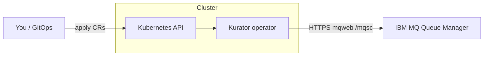

# Install and use Kurator

This guide is for **operators and application teams** who want to install Kurator
on Kubernetes and manage IBM MQ objects declaratively. It assumes you already
have a running **IBM MQ queue manager** with the **Administrative REST API**
(`mqweb`) enabled. Kurator does **not** install or scale queue managers.

For contributor setup (kind, tests, codegen), see [DEVELOPMENT.md](DEVELOPMENT.md).

Doc index: [README.md](README.md) · [../README.md](../README.md)

## On this page

| | Section |
|---|---------|
| 📦 | [What you get](#what-you-get) |
| ✅ | [Before you install](#before-you-install) |
| ⬇️ | [Install the operator](#install-the-operator) |
| 🚀 | [Quick start: one queue](#quick-start-one-queue-on-your-queue-manager) |
| ⚙️ | [How it works](#how-it-works) |
| 📖 | [Resource reference](#resource-reference) |
| 🔧 | [Sample resources](#sample-resources-in-this-repository) |
| 📅 | [Day-2 operations](#day-2-operations) |
| 🆘 | [Troubleshooting](#troubleshooting) |
| 🗑️ | [Uninstall](#uninstall) |
| ➡️ | [Next steps](#next-steps) |

## What you get

| Custom resource | Short name | Purpose |
|-----------------|------------|---------|
| `QueueManagerConnection` | `qmc` | How to reach one queue manager (endpoint, TLS, credentials) |
| `Queue` | `mq` | Local, alias, or remote queue (`QLOCAL` / `QALIAS` / `QREMOTE`) |
| `Topic` | `tp` | An administrative topic object (`DEFINE TOPIC`) |
| `Channel` | `chl` | A server-connection channel (`CHLTYPE(SVRCONN)`) |

The operator translates desired state into MQSC via `mqweb`, reports **conditions**
on each resource, and removes MQ objects when you delete a CR (finalizers).

**v1alpha1 scope:** all four CR kinds above. Queue `spec.type` supports `local`
(default), `alias`, and `remote`. Attribute drift behaviour is documented in
[ATTRIBUTE_RECONCILIATION.md](ATTRIBUTE_RECONCILIATION.md). Access control
(`SET CHLAUTH`, `SET AUTHREC`) is planned for Phase 5 — see
[PHASE5_AUTH_SKETCH.md](PHASE5_AUTH_SKETCH.md).

Sample manifests with field notes: [config/samples/README.md](../config/samples/README.md).

CR summary and release identity: [README.md#what-ships-in-v1alpha1-today](../README.md#what-ships-in-v1alpha1-today).
Test coverage: [README.md#what-ci-proves](../README.md#what-ci-proves) and
[DEVELOPMENT.md#test-tiers](DEVELOPMENT.md#test-tiers).

---

## Before you install

### Cluster requirements

- Kubernetes **1.28+**
- `kubectl` configured for your cluster
- Network path from the Kurator pod to your queue manager’s **mqweb HTTPS port**
  (typically `9443`)

### Queue manager requirements

- IBM MQ with **mqweb** and the **REST administration API** (v3 path:
  `/ibmmq/rest/v3/...`)
- An MQ administrator account that can run administrative MQSC (`DEFINE`,
  `DISPLAY`, `DELETE` on queues)
- TLS: either a CA you trust, or (development only) explicit skip-verify

### Recommended layout

Install the **operator** into a dedicated namespace (for example
`kurator-system`). Put **`QueueManagerConnection` and all workload CRs** (`Queue`,
`Topic`, `Channel`) **in the same namespace** as the credentials `Secret` they
reference — typically that same `kurator-system` namespace, or a team namespace
where you store MQ connection secrets.

---

## Install the operator

Pick one method. All paths install the same CRDs and controller.

### Option A — GitHub Release manifests (Kustomize)

Download the release tag you intend to run from
[GitHub Releases](https://github.com/konih/kurator/releases). The examples below
use **`0.1.0`** — match `VERSION` to the tag you downloaded. **`main`** and newer
tags include Topic, Channel, and alias/remote queue support beyond the first
release; check the release notes before upgrading.

```sh
VERSION=0.1.0   # replace with your release tag
curl -sLO "https://github.com/konih/kurator/releases/download/v${VERSION}/install-crds.yaml"
curl -sLO "https://github.com/konih/kurator/releases/download/v${VERSION}/install.yaml"

kubectl apply -f install-crds.yaml
kubectl apply -f install.yaml
```

Verify:

```sh
kubectl -n kurator-system rollout status deployment/kurator-controller-manager
kubectl get crd | grep messaging.kurator.dev
```

The release `install.yaml` pins the controller image to
`ghcr.io/konih/kurator:<version>`.

### Option B — Helm chart (GitHub Release tarball)

```sh
VERSION=0.1.0
curl -sLO "https://github.com/konih/kurator/releases/download/v${VERSION}/kurator-${VERSION}.tgz"

helm upgrade --install kurator "kurator-${VERSION}.tgz" \
  --namespace kurator-system \
  --create-namespace \
  --set image.repository=ghcr.io/konih/kurator \
  --set image.tag="${VERSION}"
```

### Option C — Helm chart (OCI registry on GHCR)

```sh
VERSION=0.1.0
helm upgrade --install kurator oci://ghcr.io/konih/kurator \
  --version "${VERSION}" \
  --namespace kurator-system \
  --create-namespace \
  --set image.repository=ghcr.io/konih/kurator \
  --set image.tag="${VERSION}"
```

### Option D — From this repository (development)

```sh
task deploy          # Kustomize: config/default + CRDs
# or
task deploy:helm     # Helm chart with a locally built image (kind)
```

See [DEVELOPMENT.md](DEVELOPMENT.md) and [charts/kurator/README.md](../charts/kurator/README.md).

---

## Quick start: one queue on your queue manager

After the operator is running, you need **three objects** in order:

1. A **Secret** with mqweb credentials  
2. A **`QueueManagerConnection`** that points at your queue manager  
3. A **`Queue`** that names the MQ queue to manage  

### 1. Credentials secret

```yaml
apiVersion: v1
kind: Secret
metadata:
  name: mq-credentials
  namespace: kurator-system
type: Opaque
stringData:
  username: admin
  password: "<your-mq-admin-password>"
```

Accepted password keys: `password`, `mqAdminPassword`. Username keys:
`username`, `user`, `mqAdminUser` (defaults to `admin` if omitted).

```sh
kubectl apply -f mq-credentials-secret.yaml
```

> **Security:** never commit real passwords. Prefer External Secrets, Sealed
> Secrets, or your platform’s secret store. Kurator only reads Secrets; it does
> not write credentials back to the API.

### 2. Queue manager connection

```yaml
apiVersion: messaging.kurator.dev/v1alpha1
kind: QueueManagerConnection
metadata:
  name: prod-qm1
  namespace: kurator-system
spec:
  queueManager: QM1
  endpoint: https://mq.example.com:9443
  credentialsSecretRef:
    name: mq-credentials
  tls:
    caSecretRef:
      name: mq-ca
```

For **local development only**, you may set `tls.insecureSkipVerify: true`
instead of `caSecretRef`. Do not use skip-verify in production.

The CA secret must contain PEM under `tls.crt`, `ca.crt`, or `ca.pem`.

```sh
kubectl apply -f queuemanagerconnection.yaml
kubectl wait --for=condition=Ready qmc/prod-qm1 -n kurator-system --timeout=120s
kubectl get qmc -n kurator-system
```

Expected: `Ready=True`, `Reason=Available`.

### 3. Queue

```yaml
apiVersion: messaging.kurator.dev/v1alpha1
kind: Queue
metadata:
  name: orders
  namespace: kurator-system
spec:
  connectionRef:
    name: prod-qm1
  queueName: APP.ORDERS
  type: local
  attributes:
    maxdepth: "5000"
    descr: Orders intake queue
    defpsist: "yes"
```

```sh
kubectl apply -f queue.yaml
kubectl wait --for=condition=Synced queue/orders -n kurator-system --timeout=120s
kubectl get mq -n kurator-system
```

Expected: `Synced=True`, `Reason=Available`.

Confirm on the queue manager (example with `runmqsc`):

```text
DISPLAY QLOCAL('APP.ORDERS') MAXDEPTH DESCR
```

### 4. Topic

```yaml
apiVersion: messaging.kurator.dev/v1alpha1
kind: Topic
metadata:
  name: retail-orders
  namespace: kurator-system
spec:
  connectionRef:
    name: prod-qm1
  topicName: RETAIL.ORDERS
  attributes:
    topstr: retail/orders
    descr: Retail order events topic
    pub: enabled
    sub: enabled
```

```sh
kubectl apply -f topic.yaml
kubectl wait --for=condition=Synced topic/retail-orders -n kurator-system --timeout=120s
kubectl get tp -n kurator-system
```

### 5. Channel

```yaml
apiVersion: messaging.kurator.dev/v1alpha1
kind: Channel
metadata:
  name: orders-app
  namespace: kurator-system
spec:
  connectionRef:
    name: prod-qm1
  channelName: ORDERS.APP
  type: svrconn
  attributes:
    descr: Application server-connection channel
    trptype: tcp
    maxmsgl: "4194304"
```

```sh
kubectl apply -f channel.yaml
kubectl wait --for=condition=Synced channel/orders-app -n kurator-system --timeout=120s
kubectl get chl -n kurator-system
```

---

## How it works



1. **Validating admission webhooks** (enabled by default; TLS via cert-manager)
   reject invalid specs before reconcile — for example a missing `connectionRef`,
   an alias queue without `targq`, or an invalid MQ object name. Unknown attribute
   keys may produce **warnings** but are not blocked. Webhooks never call IBM MQ.
2. **`QueueManagerConnection` reconciler** loads the credentials Secret, builds
   an mqweb client, and **pings** the queue manager. Status **`Ready`** means
   the operator can administer that manager.
3. **`Queue` reconciler** waits until `connectionRef` is **Ready**, then
   **displays** the queue. If it is missing or attributes differ, it **defines**
   the queue with `REPLACE`. Status **`Synced`** means MQ matches spec.
4. **`Topic` and `Channel` reconcilers** follow the same pattern for
   `DEFINE TOPIC` and `DEFINE CHANNEL` … `CHLTYPE(SVRCONN)`.
5. On **delete**, finalizers run `DELETE` on MQ before the CR is removed.

Connection details live on `QueueManagerConnection` so many queues, topics, and
channels can share one endpoint and credential set. See [ADR-0003](adr/0003-connection-model.md).

### Attribute reconciliation

`spec.attributes` is an open map of lowercase MQSC keys. Kurator always sends them
on **DEFINE**; **drift detection** only compares keys that mqweb can **DISPLAY**
safely on IBM MQ 9.4.x (see [ATTRIBUTE_RECONCILIATION.md](ATTRIBUTE_RECONCILIATION.md)).

- **Drift-checked** — changes off-cluster are detected and re-applied; `Synced=True`
  means these keys match MQ.
- **Define-only** — applied on create/update, but not read back (e.g. `maxmsglen` on
  queues, `sslciph` on channels). Manual MQ edits to these keys are not detected.

---

## Resource reference

### QueueManagerConnection

| Field | Required | Description |
|-------|----------|-------------|
| `spec.queueManager` | yes | Queue manager name (case-sensitive, e.g. `QM1`) |
| `spec.endpoint` | yes | mqweb base URL, must start with `https://` |
| `spec.credentialsSecretRef.name` | yes | Secret in the **same namespace** |
| `spec.restPrefix` | no | Default `/ibmmq/rest/v3` |
| `spec.tls.insecureSkipVerify` | no | Dev only — skip TLS verification |
| `spec.tls.caSecretRef.name` | no | Secret with CA PEM for mqweb |

**Status**

| Condition | Meaning |
|-----------|---------|
| `Ready=True` | mqweb reachable and credentials accepted |
| `Ready=False`, `Reason=Progressing` | Ping in progress |
| `Ready=False`, `Reason=Error` | Auth failure, bad URL, TLS error, etc. |

### Queue

| Field | Required | Description |
|-------|----------|-------------|
| `spec.connectionRef.name` | yes | `QueueManagerConnection` in the same namespace |
| `spec.queueName` | yes | IBM MQ object name (e.g. `APP.ORDERS`) |
| `spec.type` | no | `local` (default), `alias` (`QALIAS`), or `remote` (`QREMOTE`) |
| `spec.attributes` | no | MQSC parameters for `DEFINE QLOCAL` / `QALIAS` / `QREMOTE` (string keys/values) |

**Common attributes** (lowercase keys in spec):

| Attribute | Example | Drift | Notes |
|-----------|---------|-------|-------|
| `maxdepth` | `"5000"` | yes | Coerced to numeric in mqweb JSON |
| `descr` | `"Orders queue"` | yes | Description |
| `defpsist` | `"yes"` | yes | Default persistence |
| `get` / `put` | `"enabled"` | yes | Case-insensitive match |
| `maxmsglen` | `"4194304"` | no | mqweb 9.4 rejects on DISPLAY |
| `share`, `defopts`, `bothresh`, `boqname` | various | no | Passthrough on DEFINE only |

Full matrix: [ATTRIBUTE_RECONCILIATION.md](ATTRIBUTE_RECONCILIATION.md). MQSC reference:
[IBM_MQ_OBJECTS.md](IBM_MQ_OBJECTS.md).

**Status**

| Condition | Meaning |
|-----------|---------|
| `Synced=True` | Queue exists on MQ with matching attributes |
| `Synced=False`, `Reason=Progressing` | Waiting for connection `Ready` |
| `Synced=False`, `Reason=Deleting` | Removing queue from MQ |
| `Synced=False`, `Reason=Error` | MQ or configuration error (see message) |

### Topic

| Field | Required | Description |
|-------|----------|-------------|
| `spec.connectionRef.name` | yes | `QueueManagerConnection` in the same namespace |
| `spec.topicName` | yes | IBM MQ topic object name (e.g. `RETAIL.ORDERS`) |
| `spec.attributes` | no | MQSC parameters for `DEFINE TOPIC` (string keys/values) |

**Common attributes** (lowercase keys in spec):

| Attribute | Example | Drift | Notes |
|-----------|---------|-------|-------|
| `topstr` | `retail/orders` | yes | Sent as `topicStr` to mqweb |
| `descr` | `"Retail orders"` | yes | Description |
| `pub` / `sub` | `enabled` | yes | Case-insensitive match |
| `defpsist` | `yes` | yes | Default persistence |
| `pubscope` / `subscope` | `QMGR` | yes* | *Omit from DISPLAY on QM if mqweb returns `MQWB0120E` |
| `toptype`, `cluster` | various | no | Passthrough on DEFINE only |

**Status:** same `Synced` condition semantics as `Queue`.

### Channel

| Field | Required | Description |
|-------|----------|-------------|
| `spec.connectionRef.name` | yes | `QueueManagerConnection` in the same namespace |
| `spec.channelName` | yes | IBM MQ channel name (e.g. `ORDERS.APP`) |
| `spec.type` | no | Default `svrconn`. Only `svrconn` is reconciled in Phase 4 |
| `spec.attributes` | no | MQSC parameters for `DEFINE CHANNEL` |

**Common attributes** (lowercase keys in spec):

| Attribute | Example | Drift | Notes |
|-----------|---------|-------|-------|
| `trptype` | `tcp` | yes | Case-insensitive |
| `descr` | `"App channel"` | yes | Description |
| `maxmsgl` | `"4194304"` | yes | Coerced to numeric in mqweb JSON |
| `sharecnv` | `"10"` | yes | Shared conversations (SVRCONN) |
| `mcauser` | `appuser` | yes | Use with OAM/CHLAUTH in production (Phase 5) |
| `maxinst` / `maxinstc` | `"100"` | yes | Connection limits |
| `sslciph`, `sslcauth` | various | no | TLS — DEFINE only until DISPLAY support |

**Status:** same `Synced` condition semantics as `Queue`.

---

## Sample resources in this repository

Copy and adapt these; they are also applied by `task deploy:samples` on the local
kind platform.

| File | Purpose |
|------|---------|
| [`config/samples/messaging_v1alpha1_queuemanagerconnection.yaml`](../config/samples/messaging_v1alpha1_queuemanagerconnection.yaml) | Connection to in-cluster MQ on kind |
| [`config/samples/messaging_v1alpha1_queue.yaml`](../config/samples/messaging_v1alpha1_queue.yaml) | Sample `APP.ORDERS` local queue |
| [`config/samples/messaging_v1alpha1_topic.yaml`](../config/samples/messaging_v1alpha1_topic.yaml) | Sample `RETAIL.ORDERS` topic |
| [`config/samples/messaging_v1alpha1_channel.yaml`](../config/samples/messaging_v1alpha1_channel.yaml) | Sample `ORDERS.APP` SVRCONN channel |
| [`charts/kurator/samples/resources/`](../charts/kurator/samples/resources/) | Same samples for Helm workflows |
| [`config/samples/README.md`](../config/samples/README.md) | Field-by-field annotations |

**Local kind defaults** (do not use in production):

| Setting | Value |
|---------|--------|
| Queue manager | `QM1` |
| mqweb URL | `https://ibm-mq.ibm-mq.svc:9443` |
| Username / password | `admin` / `passw0rd` |
| TLS | `insecureSkipVerify: true` |

Walkthrough with the web console and `runmqsc`: [IBM_MQ_101.md](IBM_MQ_101.md).

---

## Day-2 operations

### Change queue attributes

Edit the `Queue` spec and re-apply. The operator issues `DEFINE QLOCAL ... REPLACE`
when displayed attributes differ.

```sh
kubectl edit queue orders -n kurator-system
# or
kubectl apply -f queue.yaml
```

### Add another queue on the same manager

Reuse the existing `QueueManagerConnection`; add another `Queue` with a different
`metadata.name` and `spec.queueName`.

### Rotate credentials

Update the Secret data. The mqweb client cache includes each referenced Secret's
`resourceVersion`, so the operator rebuilds the client on the next reconcile
after the Secret change (no spec bump required).

### Delete a queue, topic, or channel

```sh
kubectl delete queue orders -n kurator-system
kubectl delete topic retail-orders -n kurator-system
kubectl delete channel orders-app -n kurator-system
```

The operator deletes the MQ object, then removes the finalizer. If the object
was already gone on MQ, deletion still succeeds.

### Delete a connection

Remove dependent `Queue`, `Topic`, and `Channel` objects first.
`QueueManagerConnection` uses a finalizer for orderly teardown (connectivity
only — it does not own MQ objects on the queue manager).

---

## Troubleshooting

### `QueueManagerConnection` not Ready

```sh
kubectl describe qmc prod-qm1 -n kurator-system
kubectl logs -n kurator-system deployment/kurator-controller-manager --tail=100
```

| Symptom | Things to check |
|---------|-----------------|
| `Unauthorized` / HTTP 401 | Secret keys, password, MQ admin group |
| TLS errors | CA secret PEM, hostname vs certificate SAN, firewall |
| Timeout | Network policy, service DNS, mqweb port from operator pod |
| Wrong manager name | `spec.queueManager` must match the running QM |

Test from a debug pod:

```sh
kubectl run -it --rm curl --image=curlimages/curl --restart=Never -- \
  curl -vk -u 'admin:password' 'https://mq.example.com:9443/ibmmq/rest/v3/admin/qmgr/QM1'
```

### `Queue` stuck Progressing

The connection is not **Ready** yet:

```sh
kubectl get qmc,queue -n kurator-system
kubectl describe queue orders -n kurator-system
```

### `Queue` Error after connection is Ready

Common causes: invalid attribute for your MQ version, unsupported `type`, or MQ
authorization denying `DEFINE QLOCAL`. The condition **message** includes the
mqweb/MQSC error text.

### `Topic` or `Channel` stuck or Error

Same pattern as queues — check that the connection is **Ready**, then inspect
status and operator logs:

```sh
kubectl get qmc,topic,channel -n kurator-system
kubectl describe topic retail-orders -n kurator-system
kubectl describe channel orders-app -n kurator-system
```

Common causes: invalid `topstr` / topic name, channel attribute not supported on
your MQ version, or MQ authorization denying `DEFINE TOPIC` / `DEFINE CHANNEL`.
Only `CHLTYPE(SVRCONN)` is supported in v1alpha1.

### Operator not running

```sh
kubectl -n kurator-system get deploy,pods
kubectl -n kurator-system logs deployment/kurator-controller-manager
```

---

## Uninstall

```sh
# Remove user resources first
kubectl delete queue,topic,channel --all -n kurator-system
kubectl delete qmc --all -n kurator-system

# Operator (Helm)
helm uninstall kurator -n kurator-system

# Operator (Kustomize / release manifest)
kubectl delete -f install.yaml

# CRDs (removes all messaging.kurator.dev instances cluster-wide)
kubectl delete -f install-crds.yaml
```

---

## Next steps

- [ROADMAP.md](ROADMAP.md) — auth resources and additional MQ types on the horizon  
- [ARCHITECTURE.md](ARCHITECTURE.md) — reconcilers, security, error handling  
- [IBM_MQ_REST_API.md](IBM_MQ_REST_API.md) — how the operator calls mqweb  
- [SECURITY.md](../SECURITY.md) — reporting vulnerabilities  
