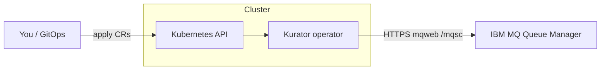

# Install and use Kurator

This guide is for **operators and application teams** who want to install Kurator
on Kubernetes and manage IBM MQ objects declaratively. It assumes you already
have a running **IBM MQ queue manager** with the **Administrative REST API**
(`mqweb`) enabled. Kurator does **not** install or scale queue managers.

For contributor setup (kind, tests, codegen), see [DEVELOPMENT.md](DEVELOPMENT.md).

## What you get

| Custom resource | Short name | Purpose |
|-----------------|------------|---------|
| `QueueManagerConnection` | `qmc` | How to reach one queue manager (endpoint, TLS, credentials) |
| `Queue` | `mq` | A local queue (`QLOCAL`) to create, update, and delete on that manager |

The operator translates desired state into MQSC via `mqweb`, reports **conditions**
on each resource, and removes MQ objects when you delete a CR (finalizers).

**v0.1.0 scope:** local queues only. Alias and remote queue types are accepted
in the API but not reconciled yet.

---

## Before you install

### Cluster requirements

- Kubernetes **1.28+**
- `kubectl` configured for your cluster
- Network path from the Kurator pod to your queue manager’s **mqweb HTTPS port**
  (typically `9443`)

### Queue manager requirements

- IBM MQ with **mqweb** and the **REST administration API** (v3 path:
  `/ibmmq/rest/v3/...`)
- An MQ administrator account that can run administrative MQSC (`DEFINE`,
  `DISPLAY`, `DELETE` on queues)
- TLS: either a CA you trust, or (development only) explicit skip-verify

### Recommended layout

Install the **operator** into a dedicated namespace (for example
`kurator-system`). Put **`QueueManagerConnection` and `Queue` objects in the
same namespace** as the credentials `Secret` they reference — typically that
same `kurator-system` namespace, or a team namespace where you store MQ
connection secrets.

---

## Install the operator

Pick one method. All paths install the same CRDs and controller.

### Option A — GitHub Release manifests (Kustomize)

Download the release that matches your version from
[GitHub Releases](https://github.com/konih/kurator/releases).

```sh
VERSION=0.1.0
curl -sLO "https://github.com/konih/kurator/releases/download/v${VERSION}/install-crds.yaml"
curl -sLO "https://github.com/konih/kurator/releases/download/v${VERSION}/install.yaml"

kubectl apply -f install-crds.yaml
kubectl apply -f install.yaml
```

Verify:

```sh
kubectl -n kurator-system rollout status deployment/kurator-controller-manager
kubectl get crd | grep messaging.kurator.dev
```

The release `install.yaml` pins the controller image to
`ghcr.io/konih/kurator:<version>`.

### Option B — Helm chart (GitHub Release tarball)

```sh
VERSION=0.1.0
curl -sLO "https://github.com/konih/kurator/releases/download/v${VERSION}/kurator-${VERSION}.tgz"

helm upgrade --install kurator "kurator-${VERSION}.tgz" \
  --namespace kurator-system \
  --create-namespace \
  --set image.repository=ghcr.io/konih/kurator \
  --set image.tag="${VERSION}"
```

### Option C — Helm chart (OCI registry on GHCR)

```sh
VERSION=0.1.0
helm upgrade --install kurator oci://ghcr.io/konih/kurator \
  --version "${VERSION}" \
  --namespace kurator-system \
  --create-namespace \
  --set image.repository=ghcr.io/konih/kurator \
  --set image.tag="${VERSION}"
```

### Option D — From this repository (development)

```sh
task deploy          # Kustomize: config/default + CRDs
# or
task deploy:helm     # Helm chart with a locally built image (kind)
```

See [DEVELOPMENT.md](DEVELOPMENT.md) and [charts/kurator/README.md](../charts/kurator/README.md).

---

## Quick start: one queue on your queue manager

After the operator is running, you need **three objects** in order:

1. A **Secret** with mqweb credentials  
2. A **`QueueManagerConnection`** that points at your queue manager  
3. A **`Queue`** that names the MQ queue to manage  

### 1. Credentials secret

```yaml
apiVersion: v1
kind: Secret
metadata:
  name: mq-credentials
  namespace: kurator-system
type: Opaque
stringData:
  username: admin
  password: "<your-mq-admin-password>"
```

Accepted password keys: `password`, `mqAdminPassword`. Username keys:
`username`, `user`, `mqAdminUser` (defaults to `admin` if omitted).

```sh
kubectl apply -f mq-credentials-secret.yaml
```

> **Security:** never commit real passwords. Prefer External Secrets, Sealed
> Secrets, or your platform’s secret store. Kurator only reads Secrets; it does
> not write credentials back to the API.

### 2. Queue manager connection

```yaml
apiVersion: messaging.kurator.dev/v1alpha1
kind: QueueManagerConnection
metadata:
  name: prod-qm1
  namespace: kurator-system
spec:
  queueManager: QM1
  endpoint: https://mq.example.com:9443
  credentialsSecretRef:
    name: mq-credentials
  tls:
    caSecretRef:
      name: mq-ca
```

For **local development only**, you may set `tls.insecureSkipVerify: true`
instead of `caSecretRef`. Do not use skip-verify in production.

The CA secret must contain PEM under `tls.crt`, `ca.crt`, or `ca.pem`.

```sh
kubectl apply -f queuemanagerconnection.yaml
kubectl wait --for=condition=Ready qmc/prod-qm1 -n kurator-system --timeout=120s
kubectl get qmc -n kurator-system
```

Expected: `Ready=True`, `Reason=Available`.

### 3. Queue

```yaml
apiVersion: messaging.kurator.dev/v1alpha1
kind: Queue
metadata:
  name: orders
  namespace: kurator-system
spec:
  connectionRef:
    name: prod-qm1
  queueName: APP.ORDERS
  type: local
  attributes:
    maxdepth: "5000"
    descr: Orders intake queue
    defpsist: "yes"
```

```sh
kubectl apply -f queue.yaml
kubectl wait --for=condition=Synced queue/orders -n kurator-system --timeout=120s
kubectl get mq -n kurator-system
```

Expected: `Synced=True`, `Reason=Available`.

Confirm on the queue manager (example with `runmqsc`):

```text
DISPLAY QLOCAL('APP.ORDERS') MAXDEPTH DESCR
```

---

## How it works



1. **`QueueManagerConnection` reconciler** loads the credentials Secret, builds
   an mqweb client, and **pings** the queue manager. Status **`Ready`** means
   the operator can administer that manager.
2. **`Queue` reconciler** waits until `connectionRef` is **Ready**, then
   **displays** the queue. If it is missing or attributes differ, it **defines**
   the queue with `REPLACE`. Status **`Synced`** means MQ matches spec.
3. On **delete**, finalizers run `DELETE QLOCAL` on MQ before the CR is removed.

Connection details live on `QueueManagerConnection` so many queues can share one
endpoint and credential set. See [ADR-0003](adr/0003-connection-model.md).

---

## Resource reference

### QueueManagerConnection

| Field | Required | Description |
|-------|----------|-------------|
| `spec.queueManager` | yes | Queue manager name (case-sensitive, e.g. `QM1`) |
| `spec.endpoint` | yes | mqweb base URL, must start with `https://` |
| `spec.credentialsSecretRef.name` | yes | Secret in the **same namespace** |
| `spec.restPrefix` | no | Default `/ibmmq/rest/v3` |
| `spec.tls.insecureSkipVerify` | no | Dev only — skip TLS verification |
| `spec.tls.caSecretRef.name` | no | Secret with CA PEM for mqweb |

**Status**

| Condition | Meaning |
|-----------|---------|
| `Ready=True` | mqweb reachable and credentials accepted |
| `Ready=False`, `Reason=Progressing` | Ping in progress |
| `Ready=False`, `Reason=Error` | Auth failure, bad URL, TLS error, etc. |

### Queue

| Field | Required | Description |
|-------|----------|-------------|
| `spec.connectionRef.name` | yes | `QueueManagerConnection` in the same namespace |
| `spec.queueName` | yes | IBM MQ object name (e.g. `APP.ORDERS`) |
| `spec.type` | no | Default `local`. Only `local` is reconciled in v0.1.0 |
| `spec.attributes` | no | MQSC parameters for `DEFINE QLOCAL` (string keys/values) |

**Common attributes** (lowercase keys in spec):

| Attribute | Example | Notes |
|-----------|---------|-------|
| `maxdepth` | `"5000"` | Coerced to numeric in mqweb JSON |
| `descr` | `"Orders queue"` | Description |
| `defpsist` | `"yes"` | Default persistence |
| `maxmsglen` | `"4194304"` | Define only; not displayed back via mqweb 9.4 JSON |
| `get` / `put` | `"enabled"` | Use with care in production |

More MQSC context: [IBM_MQ_OBJECTS.md](IBM_MQ_OBJECTS.md).

**Status**

| Condition | Meaning |
|-----------|---------|
| `Synced=True` | Queue exists on MQ with matching attributes |
| `Synced=False`, `Reason=Progressing` | Waiting for connection `Ready` |
| `Synced=False`, `Reason=Deleting` | Removing queue from MQ |
| `Synced=False`, `Reason=Error` | MQ or configuration error (see message) |

---

## Sample resources in this repository

Copy and adapt these; they are also applied by `task deploy:samples` on the local
kind platform.

| File | Purpose |
|------|---------|
| [`config/samples/messaging_v1alpha1_queuemanagerconnection.yaml`](../config/samples/messaging_v1alpha1_queuemanagerconnection.yaml) | Connection to in-cluster MQ on kind |
| [`config/samples/messaging_v1alpha1_queue.yaml`](../config/samples/messaging_v1alpha1_queue.yaml) | Sample `APP.ORDERS` local queue |
| [`charts/kurator/samples/resources/`](../charts/kurator/samples/resources/) | Same samples for Helm workflows |
| [`config/samples/README.md`](../config/samples/README.md) | Field-by-field annotations |

**Local kind defaults** (do not use in production):

| Setting | Value |
|---------|--------|
| Queue manager | `QM1` |
| mqweb URL | `https://ibm-mq.ibm-mq.svc:9443` |
| Username / password | `admin` / `passw0rd` |
| TLS | `insecureSkipVerify: true` |

Walkthrough with the web console and `runmqsc`: [IBM_MQ_101.md](IBM_MQ_101.md).

---

## Day-2 operations

### Change queue attributes

Edit the `Queue` spec and re-apply. The operator issues `DEFINE QLOCAL ... REPLACE`
when displayed attributes differ.

```sh
kubectl edit queue orders -n kurator-system
# or
kubectl apply -f queue.yaml
```

### Add another queue on the same manager

Reuse the existing `QueueManagerConnection`; add another `Queue` with a different
`metadata.name` and `spec.queueName`.

### Rotate credentials

Update the Secret data. The operator rebuilds the mqweb client on the next
reconcile when the connection or Secret changes.

### Delete a queue

```sh
kubectl delete queue orders -n kurator-system
```

The operator deletes `APP.ORDERS` on MQ, then removes the finalizer. If the queue
was already gone on MQ, deletion still succeeds.

### Delete a connection

Remove dependent `Queue` objects first. `QueueManagerConnection` uses a finalizer
for orderly teardown; in v0.1.0 it mainly guards API lifecycle (no remote objects
to delete beyond connectivity).

---

## Troubleshooting

### `QueueManagerConnection` not Ready

```sh
kubectl describe qmc prod-qm1 -n kurator-system
kubectl logs -n kurator-system deployment/kurator-controller-manager --tail=100
```

| Symptom | Things to check |
|---------|-----------------|
| `Unauthorized` / HTTP 401 | Secret keys, password, MQ admin group |
| TLS errors | CA secret PEM, hostname vs certificate SAN, firewall |
| Timeout | Network policy, service DNS, mqweb port from operator pod |
| Wrong manager name | `spec.queueManager` must match the running QM |

Test from a debug pod:

```sh
kubectl run -it --rm curl --image=curlimages/curl --restart=Never -- \
  curl -vk -u 'admin:password' 'https://mq.example.com:9443/ibmmq/rest/v3/admin/qmgr/QM1'
```

### `Queue` stuck Progressing

The connection is not **Ready** yet:

```sh
kubectl get qmc,queue -n kurator-system
kubectl describe queue orders -n kurator-system
```

### `Queue` Error after connection is Ready

Common causes: invalid attribute for your MQ version, unsupported `type`, or MQ
authorization denying `DEFINE QLOCAL`. The condition **message** includes the
mqweb/MQSC error text.

### Operator not running

```sh
kubectl -n kurator-system get deploy,pods
kubectl -n kurator-system logs deployment/kurator-controller-manager
```

---

## Uninstall

```sh
# Remove user resources first
kubectl delete queue --all -n kurator-system
kubectl delete qmc --all -n kurator-system

# Operator (Helm)
helm uninstall kurator -n kurator-system

# Operator (Kustomize / release manifest)
kubectl delete -f install.yaml

# CRDs (removes all Queue / QueueManagerConnection instances cluster-wide)
kubectl delete -f install-crds.yaml
```

---

## Next steps

- [ROADMAP.md](ROADMAP.md) — Topic, Channel, and auth resources on the horizon  
- [ARCHITECTURE.md](ARCHITECTURE.md) — reconcilers, security, error handling  
- [IBM_MQ_REST_API.md](IBM_MQ_REST_API.md) — how the operator calls mqweb  
- [SECURITY.md](../SECURITY.md) — reporting vulnerabilities  
